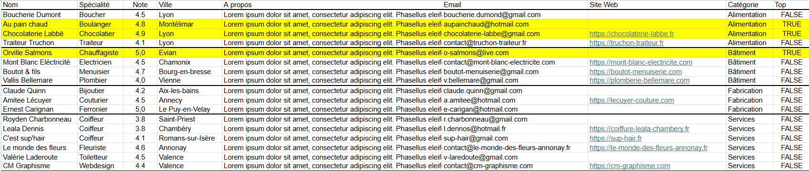
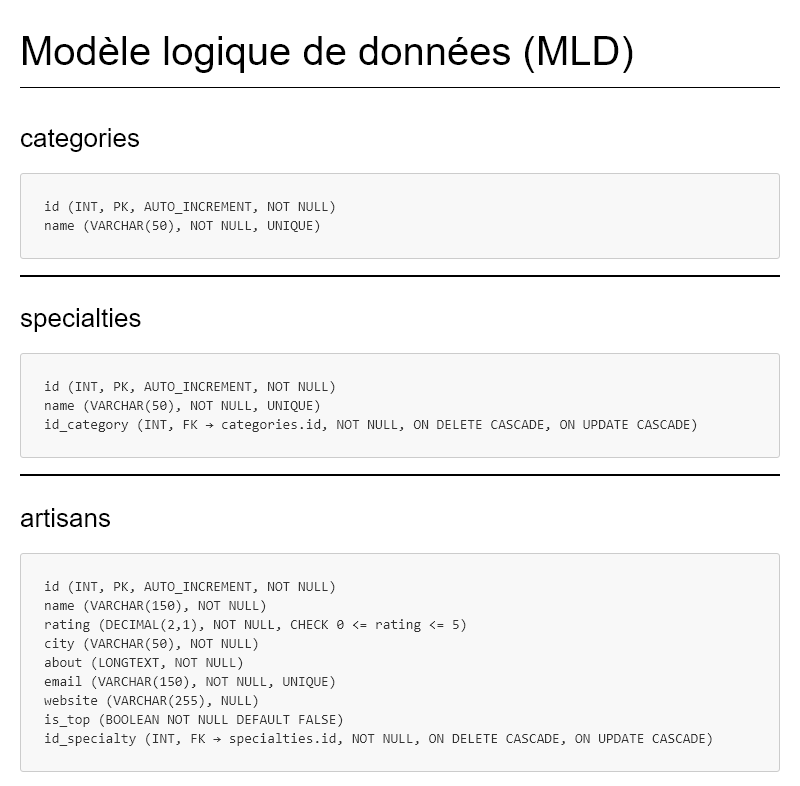

# Trouve ton artisan

Devoir bilan : Formation Développeur Web & Web Mobile au Centre Européen de Formation.

---

## Objectif
Création d'un site permettant aux particuliers de trouver facilement
un artisan selon sa spécialité ou via une recherche.

Le projet doit respecter plusieurs contraintes :

- Interface responsive
- Navigation simple
- Accessibilité
- Intégration avec une API backend
- Base de données contenant les artisans, les spécialitées et les catégories

## Stack technique

**Frontend**
- React
- Bootstrap
- Sass

**Backend**
- Node.js
- Express
- Sequelize
- dotenv

**Base de données**
- MySQL  / MariaDB
- MySQL Workbench

---

## Structure du projet

```
devoir-bilan-trouve-ton-artisan
├── .github/
│   ├── ISSUE_TEMPLATE/
│   │   └── issue-template.md
│   └── pull_request_template.md
│
├── backend/
│   ├── config/
│   │    └── database.js
│   ├── controllers/
│   ├── middleware/
│   ├── models/
│   ├── routes/
│   ├── app.js
│   ├── package.json
│   ├── package-lock.json
│   └── server.js
│
├── database/
│   ├── DATA/
│   │   ├── data.png
│   │   └── data.xlsx
│   ├── MCD/
│   │   ├── MCD_trouve_ton_artisan_url.url
│   │   ├── MCD_trouve_ton_artisan.mcd
│   │   └── MCD_trouve_ton_artisan.svg
│   ├── MLD/
│   │    ├── MLD_Diagram_EER_trouve_ton_artisan.mwb
│   │    ├── MLD_Diagram_EER_trouve_ton_artisan.mwb.bak
│   │    ├── MLD_Diagram_EER_trouve_ton_artisan.png
│   │    ├── MLD_trouve_ton_artisan.md
│   │    └── MLD_trouve_ton_artisan.pdf
│   └── SQL/
│       ├── queries.sql
│       ├── schema.sql
│       └── seed.sql
│
├── docs/
│   ├── diagrammes
│   ├── figma/
│   │   ├── models
│   │   │   ├── model-desktop.png
│   │   │   ├── model-mobile.png
│   │   │   └── model-tablet.png
│   │   └── wireframes
│   │       ├── wireframe-desktop.png
│   │       ├── wireframe-mobile.png
│   │       └── wireframe-tablet.png
│   └── pdf
│       ├── markdown-pdf.css
│       ├── project.md
│       └── project.pdf
│
├── frontend/
│   ├── src/
│   │   ├── assets/
│   │   │   ├── icons/
│   │   │   ├── images/
│   │   │   └── logos/
│   │   │       └── logo-trouve-ton-artisan.png
│   │   ├── components/
│   │   ├── pages/
│   │   │   ├── Artisan_Details.jsx
│   │   │   ├── Artisans_list.jsx
│   │   │   ├── Home.jsx
│   │   │   ├── Not_Found.jsx
│   │   │   └── Under_Construction.jsx
│   │   ├── router/
│   │   │   └── index.jsx
│   │   ├── services/
│   │   ├── styles/
│   │   │   └── main.scss
│   │   ├── App.jsx
│   │   └── main.jsx
│   ├── eslint.config.js
│   ├── index.html
│   ├── package-lock.json
│   ├── package.json
│   └── vite.config.js
│
├── .gitignore
└── README.md
```

Le **backend** est structuré selon **une architecture en couches** :
- config
- controllers
- middleware
- models
- routes

Le **frontend** est structuré selon **une architecture modulaire** :
- assets
- pages
- components
- router
- services
- styles

---

## UX/UI Design

[Lien vers la maquette Figma : Kernec_Cedric_Devoir_Bilan_Trouve_Ton_Artisan](https://www.figma.com/design/C0moU99nW9cfFlHHRzYXxc/Kernec_Cedric_Devoir_Bilan_Trouve_Ton_Artisan?node-id=38-3103&t=fcY6xDrTEQbigvnm-1)

### Design System
- Token (primitive / semantic / component)
- Composants réutilisables

### Wireframes

#### Wireframe Mobile

#### Wireframe Tablet

#### Wireframe Desktop


### Models

#### Model Mobile

#### Model Tablet

#### Model Desktop


---

## DataBase

La base de données a été conçu sur une logique de modélisation en deux étapes :
- Modèle Conceptuel de Données (MCD)
- Modèle Logique de Données (MLD)

Elle respecte le tableau de données transmit par le client :


et repose sur 3 entités principales :
- `catégories`
- `specialties`
- `artisans`

### Relations

- Une catégorie peut être attachée à plusieurs spécialités (1,N)
- Une spécialité est attachée à une seule catégorie (1,1)
- Une spécialité peut caractériser plusieurs artisans (1,N)
- Un artisan est caractérisé par une seule spécialité (1,1)

### Modèle Conceptuel de Données (MCD)


### Modèle Logique de Données graphique - Diagram EER (MLD)


### Modèle Logique de Données textuel - Schéma relationnel (MLD)


📄 [database/MLD/MLD_trouve_ton_artisan.pdf](./database/MLD/MLD_trouve_ton_artisan.pdf)

### Documentation des données

Un dictionnaire de données détaillé est disponible dans le projet afin de décrire :
- les champs
- les types
- les contraintes

👉 Voir : 📄 [database/db_doc.pdf](./database/db_doc.pdf)

### Script SQL

Les scripts SQL sont organisés comme suit :
- `schema.sql` → Création des la DB et des tables
- `seed.sql` → Insertion des données initiales
- `queries.sql` → Requête métier principales :
  - top artisans du mois
  - filtrage par catégorie
  - recherche par mot-clé (nom, spécialité, ville)
  - recherche combinée (filtrage par catégorie et recherche par mot-clé)
  - détail d'un artisan
---

## Installation

### Backend

1. Depuis le dossier `backend/` :

```
npm install
```

2. Créer un fichier `.env` avec les variables suivantes :

```
DB_NAME=trouve_ton_artisan
DB_USER=my_username (nom d'utilisateur de connexion)
DB_PASSWORD=my_password (mot de passe de connexion)
DB_HOST=localhost
DB_DIALECT=mysql (compatible MariaDB)
PORT=3000
```

3. Exécuter les scripts SQL :

- Exécuter `schema.sql` (création de la base de données ou réinitialisation si elle est déjà existante)
- Exécuter `seed.sql` (injection des données)

4. Lancer le serveur :

```
node server.js
```

### Frontend

1. Depuis le dossier `frontend/` :

```
npm install
```

2. Lancer l'application :

```
npm run dev
```

3. Accéder à l'application : http://localhost:5173

