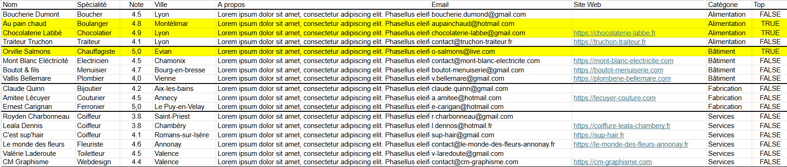
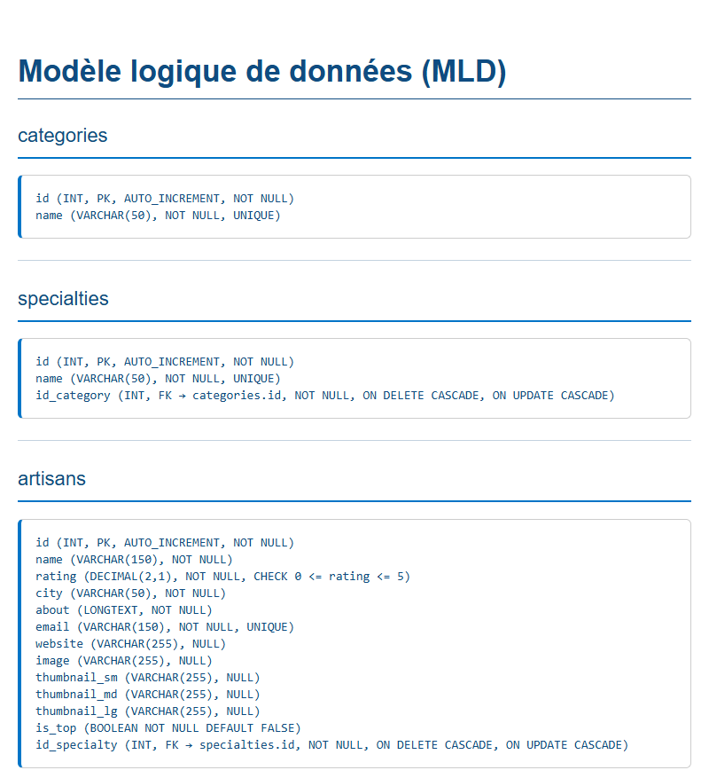

# Trouve ton artisan

Devoir bilan : Formation Développeur Web & Web Mobile au Centre Européen de Formation.


| Technologie |             |
|-------------|-------------|
| Frontend |   |
| Backend |  |
| ORM | |
| Database |  |

| Déploiement |             |
|-------------|-------------|
| Frontend |  |
| Backend |  |
| Database |  |

| Qualité |         |
|---------|---------|
| Responsive |    |

---

## Liens rapides
- Application en ligne : https://auvergnerhonealpes-trouve-ton-artisan.netlify.app/
- API backend : https://trouve-ton-artisan-api-xt2w.onrender.com/
- Maquette Figma : https://www.figma.com/design/C0moU99nW9cfFlHHRzYXxc/Kernec_Cedric_Devoir_Bilan_Trouve_Ton_Artisan?node-id=38-3103&t=fcY6xDrTEQbigvnm-1
- [Documentation complète du projet](./docs/pdf/project.pdf)
- Repository GitHub : https://github.com/pixseed/devoir-bilan-trouve-ton-artisan/

---

## Sommaire

- [Trouve ton artisan](#trouve-ton-artisan)
  - [Liens rapides](#liens-rapides)
  - [Sommaire](#sommaire)
  - [Présentation](#présentation)
  - [Fonctionnalités](#fonctionnalités)
    - [Frontend](#frontend)
    - [Backend](#backend)
    - [Database](#database)
  - [Stack technique](#stack-technique)
    - [Frontend](#frontend-1)
    - [Backend](#backend-1)
    - [Base de données](#base-de-données)
  - [Structure du projet](#structure-du-projet)
    - [Dossier principaux](#dossier-principaux)
    - [Détails de la structure et du flux d'une requête](#détails-de-la-structure-et-du-flux-dune-requête)
  - [UX/UI Design](#uxui-design)
    - [Design System](#design-system)
    - [Wireframes](#wireframes)
      - [Wireframe Mobile](#wireframe-mobile)
      - [Wireframe Tablet](#wireframe-tablet)
      - [Wireframe Desktop](#wireframe-desktop)
    - [Models](#models)
      - [Model Mobile](#model-mobile)
      - [Model Tablet](#model-tablet)
      - [Model Desktop](#model-desktop)
  - [Database](#database-1)
    - [Relations](#relations)
    - [Modèle Conceptuel de Données (MCD)](#modèle-conceptuel-de-données-mcd)
    - [Modèle Logique de Données graphique - Diagram EER (MLD)](#modèle-logique-de-données-graphique---diagram-eer-mld)
    - [Modèle Logique de Données textuel - Schéma relationnel (MLD)](#modèle-logique-de-données-textuel---schéma-relationnel-mld)
    - [Documentation des données](#documentation-des-données)
    - [Script SQL](#script-sql)
    - [Modélisation des données (Sequelize)](#modélisation-des-données-sequelize)
  - [Installation \& Lancement](#installation--lancement)
    - [Prérequis](#prérequis)
    - [1. Installation du projet](#1-installation-du-projet)
    - [2. Configuration des variables d'environnement](#2-configuration-des-variables-denvironnement)
    - [3. Lancement de la base de données](#3-lancement-de-la-base-de-données)
    - [4. Initialisation de la base de données](#4-initialisation-de-la-base-de-données)
    - [5. Lancement en développement](#5-lancement-en-développement)
    - [5.bis Lancement manuel (optionnel)](#5bis-lancement-manuel-optionnel)
    - [6. Lancement en mode pré-production](#6-lancement-en-mode-pré-production)
    - [7. Accès à l’application](#7-accès-à-lapplication)
  - [API Endpoints](#api-endpoints)
    - [Artisans](#artisans)
    - [Catégories](#catégories)
  - [API Documentation (Postman)](#api-documentation-postman)
    - [Fonctionnalité testées :](#fonctionnalité-testées-)
    - [Cas de test couverts :](#cas-de-test-couverts-)
    - [Utilisation :](#utilisation-)
  - [Liens utiles](#liens-utiles)
  - [Informations](#informations)


---

## Présentation

Trouve ton artisan est une application web permettant aux particuliers de rechercher facilement des artisans locaux selon leur spécialité ou leur domaine d'activité.

Le projet a été réalisé dans le cadre du devoir bilan de la formation Développeur Web et Web Mobile du Centre Européen de Formation.

L'objectif est de proposer une expérience utilisateur simple, accessible et responsive tout en s'appuyant sur une architecture frontend/backend basée sur React, Express et MySQL.


---

## Fonctionnalités

### Frontend
- Affichage du top 3 des artisans
- Consultation de la liste complète des artisans référencés
- Recherche par mot-clé
- Filtrage par catégorie
- Consultation de la fiche détaillée des artisans
- Formulaire de contact
- Responsive mobile / tablette / desktop

### Backend
- API REST Express
- Validation des données
- Gestion centralisée des erreurs
- Limitation du nombre de requêtes (Rate Limiting)
- Sérialisation des réponses

### Database
- Gestion des catégories
- Gestion des spécialités
- Gestion des artisans

---

## Stack technique

### Frontend
- React + Vite
- Bootstrap
- Sass
- clsx

### Backend
- Node.js
- Express
- Sequelize
- dotenv

### Base de données
- MySQL

---

## Structure du projet

```
devoir-bilan-trouve-ton-artisan
├── .github/
│
├── backend/
│   ├── config/
│   ├── controllers/
│   ├── middlewares/
│   ├── models/
│   ├── public/
│   ├── repositories/
│   ├── routes/
│   ├── serializers/
│   ├── services/
│   ├── utils/
│   ├── validators/
│   │
│   ├── app.js
│   ├── eslint.config.js
│   ├── package-lock.json
│   ├── package.json
│   └── server.js
│
├── database/
│   ├── DATA/
│   ├── MCD/
│   ├── MLD/
│   ├── SQL/
│   │   ├── queries.sql
│   │   ├── schema.sql
│   │   └── seed.sql
│   │
│   ├── db_doc.md
│   └── db_doc.pdf
│
├── docs/
│   ├── images/
│   │   ├── audits/
│   │   ├── diagrammes/
│   │   ├── figma/
│   │   └── logos/
│   ├── pdf/
│   │   ├── markdown-pdf.css
│   │   ├── project.md
│   │   └── project.pdf
│   └── postman/
│       ├── pm_collection.json
│       └── pm_environment.json
│
├── frontend/
│   ├── public/
│   ├── src/
│   │   ├── assets/
│   │   ├── components/
│   │   │   ├── features/
│   │   │   ├── layout/
│   │   │   ├── templates/
│   │   │   └── ui/
│   │   ├── config/
│   │   ├── constants/
│   │   ├── hooks/
│   │   │   ├── data/
│   │   │   ├── features/
│   │   │   └── ui/
│   │   ├── mocks/
│   │   ├── pages/
│   │   │   ├── ArtisanDetails.jsx
│   │   │   ├── ArtisansList.jsx
│   │   │   ├── Home.jsx
│   │   │   ├── NotFound.jsx
│   │   │   └── UnderConstruction.jsx
│   │   ├── router/
│   │   │   └── AppRouter.jsx
│   │   ├── services/
│   │   │   ├── apiClient.jsx
│   │   │   ├── artisansService.jsx
│   │   │   └── categoriesService.jsx
│   │   ├── styles/
│   │   │   ├── base/
│   │   │   ├── components/
│   │   │   ├── layout/
│   │   │   ├── pages/
│   │   │   ├── settings/
│   │   │   │   └── tokens/
│   │   │   └── tools/
│   │   ├── utils/
│   │   │
│   │   ├── App.jsx
│   │   └── main.jsx
│   │
│   ├── eslint.config.js
│   ├── index.html
│   ├── package-lock.json
│   ├── package.json
│   └── vite.config.js
│
├── scripts/
├── shared/
│
├── .gitignore
├── package-lock.json
├── package.json
└── README.md
```

### Dossier principaux

| Dossier | Description |
|---------|-------------|
| backend | API Express et logique métier |
| frontend | Interface React |
| database | Modélisation et scripts SQL |
| docs | Documentation du projet |
| scripts | Scripts utilitaires |
| shared | Ressources partagées |

### Détails de la structure et du flux d'une requête

Le **backend** est structuré selon **une architecture en couches** :

```
Request
↓
Middlewares
↓
Routes
↓
Controllers
↓
Services
↓
Repositories
↓
Models
↓
Database
```

Le **frontend** est structuré par **domaines de responsabilité** :

- assets
- components
- config
- constants
- hooks
- mocks
- pages
- router
- services
- styles
- utils


.png)


---

## UX/UI Design

[Lien vers la maquette Figma : Kernec_Cedric_Devoir_Bilan_Trouve_Ton_Artisan](https://www.figma.com/design/C0moU99nW9cfFlHHRzYXxc/Kernec_Cedric_Devoir_Bilan_Trouve_Ton_Artisan?node-id=38-3103&t=fcY6xDrTEQbigvnm-1)

### Design System
- Token (primitive / semantic / component)
- Composants réutilisables

### Wireframes

#### Wireframe Mobile

#### Wireframe Tablet

#### Wireframe Desktop


### Models

#### Model Mobile

#### Model Tablet

#### Model Desktop


---

## Database

La base de données a été conçu sur une logique de modélisation en deux étapes :
- Modèle Conceptuel de Données (MCD)
- Modèle Logique de Données (MLD)

Elle respecte le tableau de données transmis par le client :


et repose sur 3 entités principales :
- `categories`
- `specialties`
- `artisans`

### Relations

- Une catégorie peut être attachée à plusieurs spécialités (1,N)
- Une spécialité est attachée à une seule catégorie (1,1)
- Une spécialité peut caractériser plusieurs artisans (1,N)
- Un artisan est caractérisé par une seule spécialité (1,1)

### Modèle Conceptuel de Données (MCD)


### Modèle Logique de Données graphique - Diagram EER (MLD)


### Modèle Logique de Données textuel - Schéma relationnel (MLD)


📄 [database/MLD/MLD_trouve_ton_artisan.pdf](./database/MLD/MLD_trouve_ton_artisan.pdf)

### Documentation des données

Un dictionnaire de données détaillé est disponible dans le projet afin de décrire :
- les champs
- les types
- les contraintes

👉 Voir : 📄 [database/db_doc.pdf](./database/db_doc.pdf)

### Script SQL

Les scripts SQL sont organisés comme suit :
- `schema.sql` → Création de la base de données et des tables
- `seed.sql` → Insertion des données initiales
- `queries.sql` → Requêtes métier principales :
  - top artisans du mois
  - filtrage par catégorie
  - recherche par mot-clé (nom, spécialité, ville)
  - recherche combinée (filtrage par catégorie et recherche par mot-clé)
  - détail d'un artisan

### Modélisation des données (Sequelize)

Les modèles Sequelize implémentent la structure définie dans le MLD.

Ces relations sont implémentées via Sequelize avec les méthodes :
- `hasMany()` → indique qu'un modèle possède plusieurs instances d'un autre modèle (relation 1 → N).
- `belongsTo()` → indique qu'un modèle appartient à un autre modèle (relation N → 1).

Des alias (`as`) sont utilisés afin de faciliter les requêtes imbriquées avec `include`.

---

## Installation & Lancement

### Prérequis

Avant de lancer le projet, assurez-vous d’avoir installé :
- Node.js
- npm
- MySQL

>Scripts disponibles
>  
>Le projet utilise des scripts npm pour simplifier le développement :
>- `npm run dev` → Lance simultanément le frontend et le backend
>- `npm run frontend` → Lance uniquement le frontend (React + Vite)
>- `npm run backend` → Lance uniquement le backend (Node.js + Express + Sequelize)
> 
>Le lancement simultané est géré grâce à **concurrently**.

### 1. Installation du projet

Depuis la racine du projet :

```bash
git clone https://github.com/pixseed/devoir-bilan-trouve-ton-artisan.git
cd devoir-bilan-trouve-ton-artisan
npm install
```

Installer ensuite les dépendances du backend :

```bash
cd backend
npm install
```

Installer ensuite les dépendances du frontend :

```bash
cd ../frontend
npm install
```

### 2. Configuration des variables d'environnement

**Fichier .env**

Créer un fichier `.env` dans le dossier `backend/` :

```
DB_NAME=trouve_ton_artisan
DB_USER=your_username
DB_PASSWORD=your_password
DB_HOST=localhost
DB_DIALECT=mysql
DB_PORT=3306

PORT=3000
FRONTEND_URL=http://localhost:5173,http://localhost:4173
```

Créer un fichier `.env` dans le dossier `frontend/` :

```
VITE_API_URL=http://localhost:3000
VITE_SITE_URL=http://localhost:5173
```

### 3. Lancement de la base de données

Avant de lancer l'API, assurez-vous d'avoir lancé votre serveur MySQL.

Exemple avec XAMPP :
- Lancer XAMPP
- Démarrer le service MySQL

### 4. Initialisation de la base de données

Via MySQL Workbench :

1. Importer les fichiers présents dans le projet :
   - `source database/SQL/schema.sql`
   - `source database/SQL/seed.sql`

2. Créer/Réinitialiser la base de données :

```
Lancer le script schema.sql
```

3. Insérer les données :

```
Lancer le script seed.sql
```

### 5. Lancement en développement

```Bash
npm run dev
```

Cette commande lance simultanément :
- le serveur backend (port 3000)
- l’application frontend (port 5173)

### 5.bis Lancement manuel (optionnel)

Si vous souhaitez lancer les services séparément :

**Backend**

```Bash
cd backend
npm run start
```

ou

```Bash
cd backend
npm run dev
```

**Frontend**

```Bash
cd frontend
npm run dev
```

### 6. Lancement en mode pré-production

1. Lancer le serveur API depuis le dossier backend/ :

```Bash
cd backend
npm run start
```

2. Lancer Vite depuis le dossier frontend/ : 

```Bash
cd frontend
npm run build
npm run preview
```

### 7. Accès à l’application

Une fois le projet lancé :
- Accéder au **Frontend** (développement) : http://localhost:5173
- Accéder au **Frontend** (pré-production) : http://localhost:4173
- Accéder au **Backend** : http://localhost:3000⁠

Vous pouvez tester les [endpoints](#api-endpoints) via Postman (voir la section [API Documentation (Postman)](#api-documentation-postman))

---

## API Endpoints

### Artisans

- GET /artisans → Liste des artisans
- GET /artisans/top → Top artisans du mois
- GET /artisans?category=&search= → Recherche d'artisans
- GET /artisans/:id → Détail d'un artisan
- POST /artisans/:id/contact → Envoie d'un formulaire de contact à l'artisan

Body attendu pour l'envoi de formulaire de contact :

```json
{
  "name": "string",
  "email": "string",
  "object": "string",
  "message": "string"
}
```

### Catégories

- GET /categories → Liste des catégories

---

## API Documentation (Postman)

Une collection Postman et son environnement sont disponibles pour tester l'ensemble des endpoints de l'API.

📁 Emplacement :  
`/docs/postman/pm_collection.json`  
`/docs/postman/pm_environment.json`

### Fonctionnalité testées :
- Récupération des artisans et des catégories
- Recherche (globale et par catégorie)
- Détail d'un artisan
- Contact d'un artisan

### Cas de test couverts :
- ✅ 200 (cas nominal)
- ❌ 400 (requête invalide)
- ❌ 404 (ressource non trouvée)
- ❌ 429 (trop de requêtes envoyées)

### Utilisation :
1. [Lancer le serveur](#installation--lancement)
2. Importer la collection dans Postman `pm_collection.json`
3. Importer l'environnement dans Postman `pm_environment.json`
4. Sélectionner l'environnement dans Postman
5. Lancer les requêtes

## Liens utiles

- [Repository GitHub](https://github.com/pixseed/devoir-bilan-trouve-ton-artisan/)
- [Maquette Figma](https://www.figma.com/design/C0moU99nW9cfFlHHRzYXxc/Kernec_Cedric_Devoir_Bilan_Trouve_Ton_Artisan?node-id=38-3103&t=fcY6xDrTEQbigvnm-1)
- [Application en ligne](https://auvergnerhonealpes-trouve-ton-artisan.netlify.app/)
- [API backend](https://trouve-ton-artisan-api-xt2w.onrender.com/)
- [Documentation complète du projet](./docs/pdf/project.pdf)
- [Architecture globale de l'application](./docs/images/diagrammes/1.%20Architecture%20globale%20de%20l’application.png)
- [Architecture backend (logique)](./docs/images/diagrammes/2.%20Architecture%20backend%20(logique).png)
- [Flux d'une requête API](./docs/images/diagrammes/3.%20Flux%20d’une%20requête%20api%20-%20du%20navigateur%20à%20la%20réponse.png)
- [Dictionnaire de données](./database/db_doc.pdf)
- [Modèle Conceptuel de Données (MCD)](./database/MCD/MCD_trouve_ton_artisan.svg)
- [Modèle Logique de Données (MLD)](./database/MLD/MLD_trouve_ton_artisan.pdf)

---

## Informations

| Éléments | Valeur |
|----------|--------|
| Version |  |
| Auteur |   |
| Licence |  |
| Formation |  |