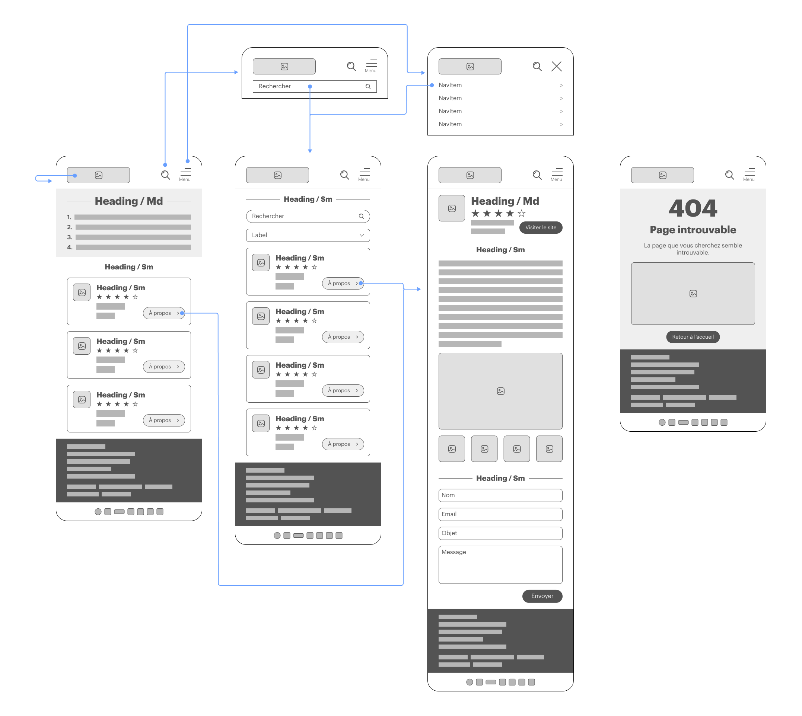
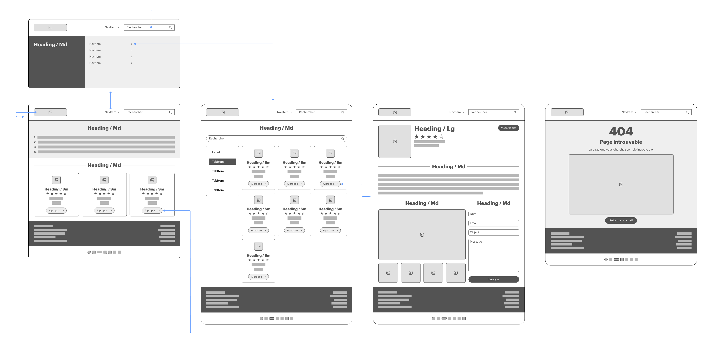
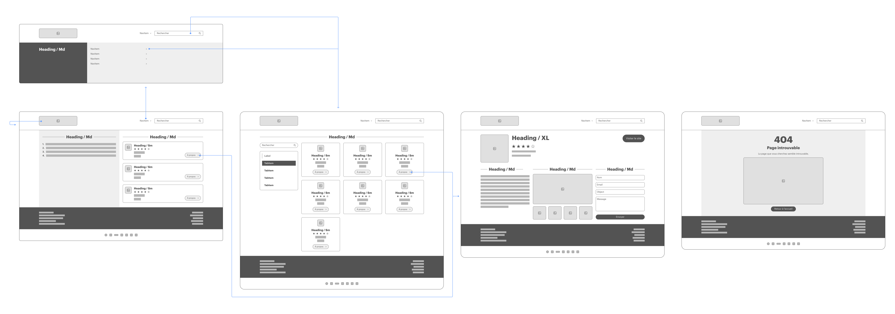
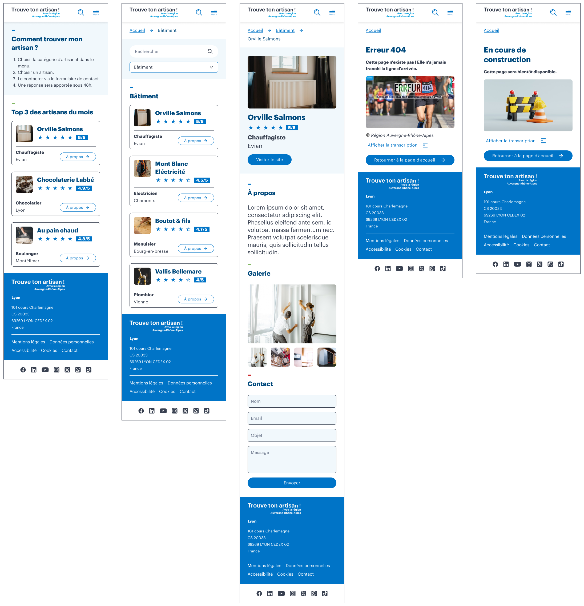
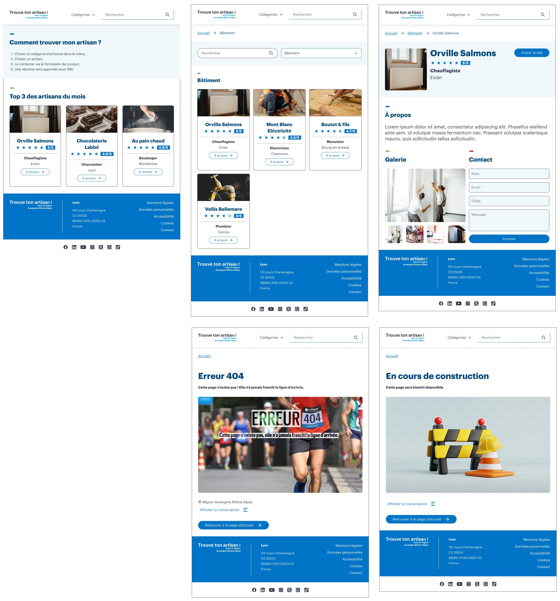
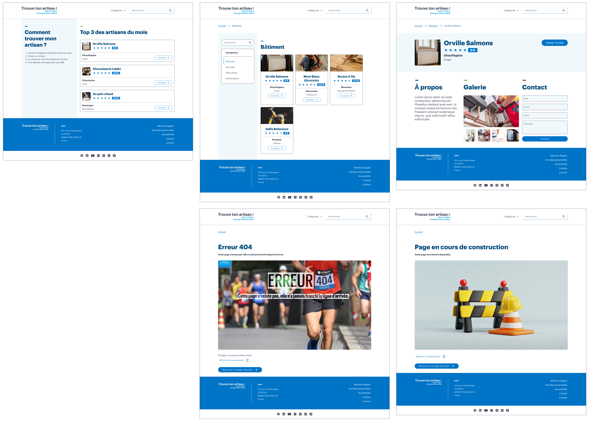
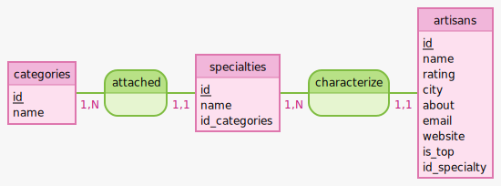
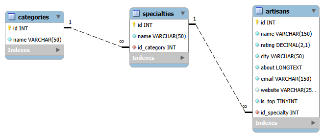

<h1>Projet : Trouve ton artisan</h1>

<h2>Devoir Bilan : "Créez le site Web 'Trouve ton artisan' avec React.JS"</h2>

Formation Développeur Web & Web Mobile - Centre Européen de Formation

<div class="project-info">

**Auteur :** Cédric Kernec  
**GitHub :** *https://github.com/**pixseed***  
**Formation :** DWWM - CEF  
**Technologie :** React, React Router, Vite, Node.js, Express, Sequelize, MySQL    
**Date :** 03/2026

</div>

<div class="page-break"></div>

## Sommaire

- [Sommaire](#sommaire)
- [1. Contexte du projet](#1-contexte-du-projet)
- [2. Présentation du client](#2-présentation-du-client)
- [3. Expression des besoins](#3-expression-des-besoins)
- [4. Contraintes techniques](#4-contraintes-techniques)
- [5. Fonctionnalités principales](#5-fonctionnalités-principales)
  - [5.1. Navigation (pages)](#51-navigation-pages)
  - [5.2. Header](#52-header)
  - [5.3. Footer](#53-footer)
  - [5.4. Page d'accueil](#54-page-daccueil)
  - [5.5. Page liste des artisans](#55-page-liste-des-artisans)
  - [5.6. Page fiche artisan](#56-page-fiche-artisan)
- [6. Architecture de l'application](#6-architecture-de-lapplication)
- [7. Livrables attendus](#7-livrables-attendus)
- [8. Maquettes et wireframes](#8-maquettes-et-wireframes)
  - [8.1. Lien vers les maquettes Figma](#81-lien-vers-les-maquettes-figma)
  - [8.2. Wireframes](#82-wireframes)
    - [8.2.1 Wireframe Mobile](#821-wireframe-mobile)
    - [8.2.2 Wireframe Tablet](#822-wireframe-tablet)
    - [8.2.3. Wireframe Desktop](#823-wireframe-desktop)
  - [8.3. Maquettes](#83-maquettes)
    - [8.3.1 Maquette Mobile](#831-maquette-mobile)
    - [8.3.2 Maquette Tablet](#832-maquette-tablet)
    - [8.3.3. Maquette Desktop](#833-maquette-desktop)
- [9. Base de données](#9-base-de-données)
  - [9.1. Modèle Conceptuel de Données (MCD)](#91-modèle-conceptuel-de-données-mcd)
  - [9.2. Modèle Logique de Données (MLD)](#92-modèle-logique-de-données-mld)
  - [9.3. Script MySQL](#93-script-mysql)

<div class="page-break"></div>

## 1. Contexte du projet

Le client est la région Auvergne-Rhône-Alpes.

L'objectif est de proposer un site permettant aux particuliers de trouver facilement
un artisan selon sa spécialité ou via une recherche.

Le projet doit respecter plusieurs contraintes :

- Interface responsive
- Navigation simple
- Accessibilité
- Intégration avec une API backend
- Base de données contenant les artisans et les catégories

---

## 2. Présentation du client

La région Auvergne-Rhône-Alpes souhaite mettre à disposition un service numérique
permettant de valoriser les artisans locaux et faciliter leur mise en relation
avec les particuliers.

[Site institutionnel : https://www.auvergnerhonealpes.fr/](https://www.auvergnerhonealpes.fr/)


---

## 3. Expression des besoins

L'application doit permettre de :

- Consulter une liste d'artisans
- Filtrer les artisans par catégorie
- Rechercher par nom
- Consulter la fiche détaillée d'un artisan
- Contacter un artisan via un formulaire

---

<div class="page-break"></div>

## 4. Contraintes techniques

Architecture technique du projet :

**Frontend** :
- React
- Vite
- React Router
- Bootstrap / CSS

**Backend** :
- Node.js
- Express

**Base de données** :
- MySQL

**ORM** :
- Sequelize

**Architecture générale** :

Frontend → API → Base de données

---

## 5. Fonctionnalités principales

### 5.1. Navigation (pages)

- Page d'accueil
- Liste des artisans (par catégorie)
- Fiche artisan
- Page 404
- Pages Légales (en cours de construction)

### 5.2. Header

- Logo
- Menu catégories
- Barre de recherche

### 5.3. Footer

- Liens pages légales
- Informations de contact

### 5.4. Page d'accueil

- Présentation du fonctionnement du site en 4 étapes
- Affichage des 3 artisans du mois

### 5.5. Page liste des artisans

- Filtrage par catégorie
- Affichage sous forme de cards
- Accès à la fiche détaillée

### 5.6. Page fiche artisan

Informations affichées :

- Nom
- Image
- Note
- Spécialité
- Localisation
- Description
- Site web éventuel
- Formulaire de contact

---

<div class="page-break"></div>

## 6. Architecture de l'application

Routes frontend :

```
/               → page accueil
/artisans       → liste des artisans
/artisan/:id    → fiche artisan
/404            → page erreur
```

---

## 7. Livrables attendus

- Wireframes (Desktop, Tablet, Mobile)
- API Node.js fonctionnelle
- Base de données MySQL
- Frontend React
- Interface responsive
- Documentation du projet

---

<div class="page-break"></div>

## 8. Maquettes et wireframes

### 8.1. Lien vers les maquettes Figma
[Voir les maquettes Figma : https://www.figma.com/design/C0moU99nW9cfFlHHRzYXxc/Kernec_Cedric_Devoir_Bilan_Trouve_Ton_Artisan?node-id=38-3103&t=fcY6xDrTEQbigvnm-1](https://www.figma.com/design/C0moU99nW9cfFlHHRzYXxc/Kernec_Cedric_Devoir_Bilan_Trouve_Ton_Artisan?node-id=38-3103&t=fcY6xDrTEQbigvnm-1)

### 8.2. Wireframes

#### 8.2.1 Wireframe Mobile


<div class="page-break"></div>

#### 8.2.2 Wireframe Tablet


#### 8.2.3. Wireframe Desktop


<div class="page-break"></div>

### 8.3. Maquettes

#### 8.3.1 Maquette Mobile


<div class="page-break"></div>

#### 8.3.2 Maquette Tablet


<div class="page-break"></div>

#### 8.3.3. Maquette Desktop


---

<div class="page-break"></div>

## 9. Base de données

Présentation de la base de données permettant de gérer un annuaire d'artisans.

La base de données à été conçu sur une logique de modélisation en deux étapes :
- un Modèle Conceptuel de Données (MCD)
- un Modèle Logique de Données (MLD)

### 9.1. Modèle Conceptuel de Données (MCD)

Le MCD permet de représenter les entités métier et leurs relations.

**Il met en évidence :**
- les catégories d'artisans
- les spécialités associées
- les artisans

**Relations :**
- Une catégorie peut être attachée à plusieurs spécialités (1,N)
- Une spécialité est attachée à une seule catégorie (1,1)
- Une spécialité peut caractériser plusieurs artisans (1,N)
- Un artisan est caractérisé par une seule spécialité (1,1)



### 9.2. Modèle Logique de Données (MLD)

Le MLD traduit le MCD en strcuture relationnelle exploitable en base de données.

**Il définit :**
- les tables (`categories`, `specialties` et `artisans`)
- les clés primaires (PK)
- les clés étrangères (FK)
- les contraintes

**Relations :**
- specialties.id_category → categories.id
- artisans.id_specialty → specialties.id

Ce modèle est directement utilisé pour la création de la base de données en SQL.



### 9.3. Script MySQL

Des requêtes SQL ont été mises en place afin de répondre aux fonctionnalités principales du projet :
- recherche d'artisans
- filtrage par catégorie
- mise en avant des artisans du mois

Ces reqûetes ont été testées et validées.
