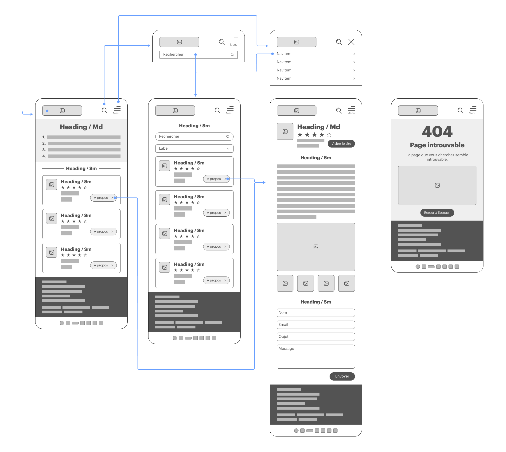
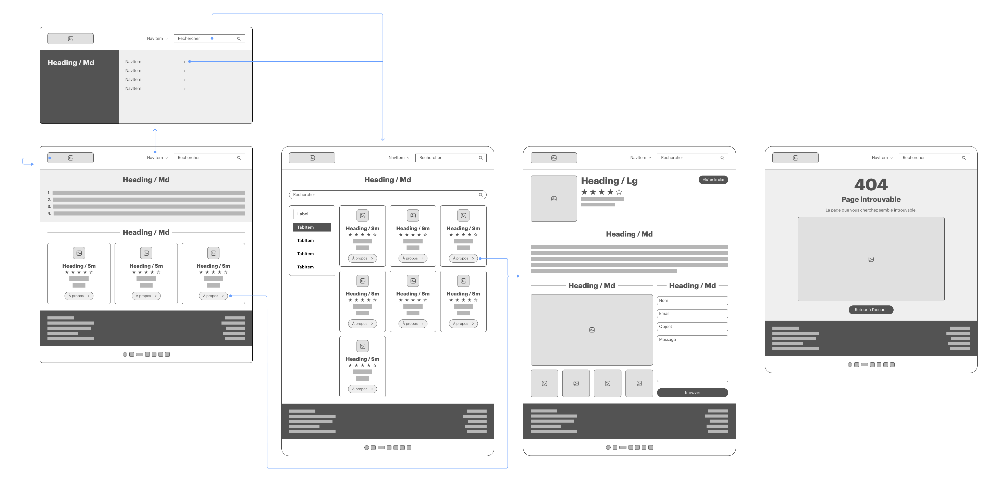
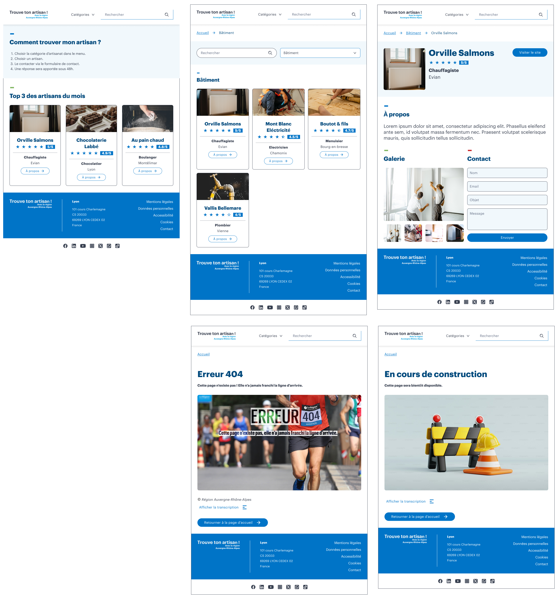
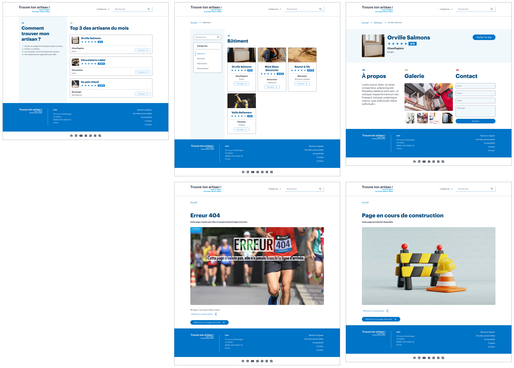
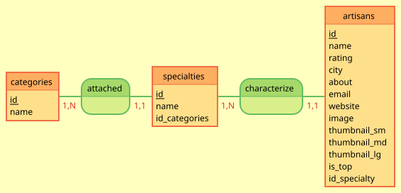
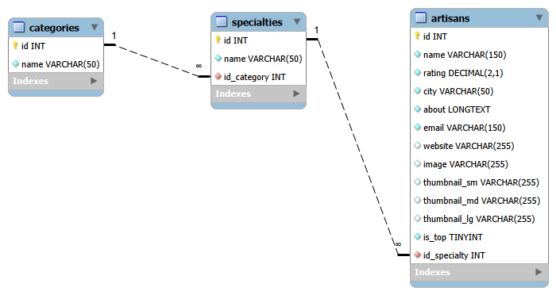

<h1>Projet : Trouve ton artisan</h1>

<h2>Devoir Bilan : "Créez le site Web 'Trouve ton artisan' avec React.JS"</h2>

Formation Développeur Web & Web Mobile - Centre Européen de Formation

<div class="project-info">

**Auteur :** Cédric Kernec  
**GitHub :** *https://github.com/**pixseed***  
**Formation :** DWWM - CEF  
**Technologie :** React, React Router, Vite, Node.js, Express, Sequelize, MySQL    
**Date :** 03/2026

</div>

<div class="page-break"></div>

## Sommaire

- [Sommaire](#sommaire)
- [1. Contexte du projet](#1-contexte-du-projet)
- [2. Présentation du client](#2-présentation-du-client)
- [3. Expression des besoins](#3-expression-des-besoins)
- [4. Contraintes techniques](#4-contraintes-techniques)
- [5. Fonctionnalités principales](#5-fonctionnalités-principales)
  - [5.1. Navigation (pages)](#51-navigation-pages)
  - [5.2. Header](#52-header)
  - [5.3. Footer](#53-footer)
  - [5.4. Page d'accueil](#54-page-daccueil)
  - [5.5. Page liste des artisans](#55-page-liste-des-artisans)
  - [5.6. Page fiche artisan](#56-page-fiche-artisan)
- [6. Architecture de l'application](#6-architecture-de-lapplication)
- [7. Livrables attendus](#7-livrables-attendus)
- [8. Maquettes et wireframes](#8-maquettes-et-wireframes)
  - [8.1. Lien vers les maquettes Figma](#81-lien-vers-les-maquettes-figma)
  - [8.2. Wireframes](#82-wireframes)
    - [8.2.1 Wireframe Mobile](#821-wireframe-mobile)
    - [8.2.2 Wireframe Tablet](#822-wireframe-tablet)
    - [8.2.3. Wireframe Desktop](#823-wireframe-desktop)
  - [8.3. Maquettes](#83-maquettes)
    - [8.3.1 Maquette Mobile](#831-maquette-mobile)
    - [8.3.2 Maquette Tablet](#832-maquette-tablet)
    - [8.3.3. Maquette Desktop](#833-maquette-desktop)
- [9. Base de données](#9-base-de-données)
  - [9.1. Modèle Conceptuel de Données (MCD)](#91-modèle-conceptuel-de-données-mcd)
  - [9.2. Modèle Logique de Données (MLD)](#92-modèle-logique-de-données-mld)
  - [9.3. Script MySQL](#93-script-mysql)
- [10. Veille sécurité](#10-veille-sécurité)
  - [10.1 Méthodologie de veille](#101-méthodologie-de-veille)
  - [10.2. Vulnérabilités étudiées](#102-vulnérabilités-étudiées)
    - [10.2.1. Entrées utilisateur non fiables](#1021-entrées-utilisateur-non-fiables)
    - [10.2.2. Exposition excessive des erreurs serveur](#1022-exposition-excessive-des-erreurs-serveur)
    - [10.2.3. Abus d'API / spam / surcharge](#1023-abus-dapi--spam--surcharge)
    - [10.2.4. Requêtes cross-origin non maîtrisées](#1024-requêtes-cross-origin-non-maîtrisées)
    - [10.2.5. Headers HTTP insuffisants](#1025-headers-http-insuffisants)
  - [10.3. Arbitrages réalisés dans le projet](#103-arbitrages-réalisés-dans-le-projet)
- [11. Sécurité mise en place](#11-sécurité-mise-en-place)
  - [11.1. Sécurisation des headers HTTP (Helmet)](#111-sécurisation-des-headers-http-helmet)
  - [11.2. Contrôle des requêtes cross-origin (CORS)](#112-contrôle-des-requêtes-cross-origin-cors)
  - [11.3. Limitation de la taille des requêtes JSON envoyées](#113-limitation-de-la-taille-des-requêtes-json-envoyées)
  - [11.4. Validation des données côté serveur](#114-validation-des-données-côté-serveur)
  - [11.5. Nettoyage des données utilisateur (Sanitization)](#115-nettoyage-des-données-utilisateur-sanitization)
  - [11.6. Protection contre l'abus de requêtes (Rate Limiting)](#116-protection-contre-labus-de-requêtes-rate-limiting)
    - [11.6.1. Protection globale de l'API](#1161-protection-globale-de-lapi)
    - [11.6.2. Protection du formulaire de contact](#1162-protection-du-formulaire-de-contact)
  - [11.7. Gestion centralisée des erreurs API](#117-gestion-centralisée-des-erreurs-api)
    - [11.7.1. Classe métier `ApiError`](#1171-classe-métier-apierror)
    - [11.7.2. Middleware global de gestion des erreurs](#1172-middleware-global-de-gestion-des-erreurs)
    - [11.7.3. Protection des informations sensibles](#1173-protection-des-informations-sensibles)
    - [11.7.4. Cohérence frontend / backend](#1174-cohérence-frontend--backend)
    - [11.7.5. Séparation des responsabilités](#1175-séparation-des-responsabilités)

<div class="page-break"></div>

## 1. Contexte du projet

Le client est la région Auvergne-Rhône-Alpes.

L'objectif est de proposer un site permettant aux particuliers de trouver facilement
un artisan selon sa spécialité ou via une recherche.

Le projet doit respecter plusieurs contraintes :

- Interface responsive
- Navigation simple
- Accessibilité
- Intégration avec une API backend
- Base de données contenant les artisans et les catégories

---

## 2. Présentation du client

La région Auvergne-Rhône-Alpes souhaite mettre à disposition un service numérique
permettant de valoriser les artisans locaux et faciliter leur mise en relation
avec les particuliers.

[Site institutionnel : https://www.auvergnerhonealpes.fr/](https://www.auvergnerhonealpes.fr/)


---

## 3. Expression des besoins

L'application doit permettre de :

- Consulter une liste d'artisans
- Filtrer les artisans par catégorie
- Rechercher par nom
- Consulter la fiche détaillée d'un artisan
- Contacter un artisan via un formulaire

---

<div class="page-break"></div>

## 4. Contraintes techniques

Architecture technique du projet :

**Frontend** :
- React
- Vite
- React Router
- Bootstrap / CSS

**Backend** :
- Node.js
- Express

**Base de données** :
- MySQL

**ORM** :
- Sequelize

**Architecture générale** :

Frontend → API → Base de données

---

## 5. Fonctionnalités principales

### 5.1. Navigation (pages)

- Page d'accueil
- Liste des artisans (par catégorie)
- Fiche artisan
- Page 404
- Pages Légales (en cours de construction)

### 5.2. Header

- Logo
- Menu catégories
- Barre de recherche

### 5.3. Footer

- Liens pages légales
- Informations de contact

### 5.4. Page d'accueil

- Présentation du fonctionnement du site en 4 étapes
- Affichage des 3 artisans du mois

### 5.5. Page liste des artisans

- Filtrage par catégorie
- Affichage sous forme de cards
- Accès à la fiche détaillée

### 5.6. Page fiche artisan

Informations affichées :

- Nom
- Image
- Note
- Spécialité
- Localisation
- Description
- Site web éventuel
- Formulaire de contact

---

<div class="page-break"></div>

## 6. Architecture de l'application

Routes frontend :

```
/               → page accueil
/artisans       → liste des artisans
/artisan/:id    → fiche artisan
/404            → page erreur
```

---

## 7. Livrables attendus

- Wireframes (Desktop, Tablet, Mobile)
- API Node.js fonctionnelle
- Base de données MySQL
- Frontend React
- Interface responsive
- Documentation du projet

---

<div class="page-break"></div>

## 8. Maquettes et wireframes

### 8.1. Lien vers les maquettes Figma
[Voir les maquettes Figma : https://www.figma.com/design/C0moU99nW9cfFlHHRzYXxc/Kernec_Cedric_Devoir_Bilan_Trouve_Ton_Artisan?node-id=38-3103&t=fcY6xDrTEQbigvnm-1](https://www.figma.com/design/C0moU99nW9cfFlHHRzYXxc/Kernec_Cedric_Devoir_Bilan_Trouve_Ton_Artisan?node-id=38-3103&t=fcY6xDrTEQbigvnm-1)

### 8.2. Wireframes

#### 8.2.1 Wireframe Mobile


<div class="page-break"></div>

#### 8.2.2 Wireframe Tablet


#### 8.2.3. Wireframe Desktop


<div class="page-break"></div>

### 8.3. Maquettes

#### 8.3.1 Maquette Mobile


<div class="page-break"></div>

#### 8.3.2 Maquette Tablet


<div class="page-break"></div>

#### 8.3.3. Maquette Desktop


---

<div class="page-break"></div>

## 9. Base de données

Présentation de la base de données permettant de gérer un annuaire d'artisans.

La base de données a été conçue sur une logique de modélisation en deux étapes :
- un Modèle Conceptuel de Données (MCD)
- un Modèle Logique de Données (MLD)

### 9.1. Modèle Conceptuel de Données (MCD)

Le MCD permet de représenter les entités métier et leurs relations.

**Il met en évidence :**
- les catégories d'artisans
- les spécialités associées
- les artisans

**Relations :**
- Une catégorie peut être attachée à plusieurs spécialités (1,N)
- Une spécialité est attachée à une seule catégorie (1,1)
- Une spécialité peut caractériser plusieurs artisans (1,N)
- Un artisan est caractérisé par une seule spécialité (1,1)



### 9.2. Modèle Logique de Données (MLD)

Le MLD traduit le MCD en structure relationnelle exploitable en base de données.

**Il définit :**
- les tables (`categories`, `specialties` et `artisans`)
- les clés primaires (PK)
- les clés étrangères (FK)
- les contraintes

**Relations :**
- specialties.id_category → categories.id
- artisans.id_specialty → specialties.id

Ce modèle est directement utilisé pour la création de la base de données en SQL.



### 9.3. Script MySQL

Des requêtes SQL ont été mises en place afin de répondre aux fonctionnalités principales du projet :
- recherche d'artisans
- filtrage par catégorie
- mise en avant des artisans du mois

Ces requêtes ont été testées et validées.

---

<div class="page-break"></div>

## 10. Veille sécurité

### 10.1 Méthodologie de veille

Dans le cadre du développement du projet, une veille de sécurité a été menée afin d'identifier les vulnérabilités courantes susceptibles d'affecter une application web exposant une API backend.

**Objectif**
Anticiper les risques de sécurité et de vulnérabilité applicable à l'architecture du projet (frontend React + API Express + base de données MySQL).

**Sources** :
Les principales sources consultées ont été :
- OWASP Top 10 : [https://owasp.org/www-project-top-ten/](https://owasp.org/www-project-top-ten/)
- documentation officielle Express : : [https://expressjs.com/](https://express.js.com/)
- documentation officielle Helmet : [https://github.com/helmetjs/helmet](https://github.com/helmetjs/helmet)
- documentation MDN Web Docs : [https://developer.mozilla.org/](https://developer.mozilla.org/)
- documentation officielle express-rate-limit : [https://github.com/express-rate-limit/express-rate-limit](https://github.com/express-rate-limit/express-rate-limit)

Cette veille a permis d'identifier plusieurs risques concrets liés aux entrées utilisateur, aux erreurs serveur, aux abus d'API ainsi qu'aux politiques de sécurité navigateur.

### 10.2. Vulnérabilités étudiées

#### 10.2.1. Entrées utilisateur non fiables

Risques :
- données invalides
- injections
- corruption

#### 10.2.2. Exposition excessive des erreurs serveur

Risques :
- fuite stack trace
- structure backend exposée

<div class="page-break"></div>

#### 10.2.3. Abus d'API / spam / surcharge

Risques :
- spam formulaire
- surcharges des ressources serveur

#### 10.2.4. Requêtes cross-origin non maîtrisées

Risques :
- appels navigateur non souhaités

#### 10.2.5. Headers HTTP insuffisants

Risques :
- XSS (Cross-Site Scripting) : vulnérabilité permettant d'injecter du code malveillant dans une application web afin qu'il soit exécuté par le navigateur.
- clickjacking : technique consistant à piéger un utilisateur intégrant l'application dans un carde invisible (`iframe`) ou trompeur afin de détourner ses clics.

### 10.3. Arbitrages réalisés dans le projet

Cette veille a influencé les choix d'architecture présentés dans la section `11. Sécurité mise en place`, notamment :
- validation systématique côté backend
- sanitization des entrées utilisateurs
- limitation de débit des requêtes
- sécurisation des headers HTTP
- gestion centralisée des erreurs
- masquage des informations sensibles en production

---

<div class="page-break"></div>

## 11. Sécurité mise en place

### 11.1. Sécurisation des headers HTTP (Helmet)

Afin de renforcer la sécurité globale de l'API backend, le middleware `Helmet` a été mis en place.

Helmet ajoute automatiquement plusieurs en-têtes HTTP de sécurité permettant de limiter certaines attaques côté navigateur.

Cela permet de :
- réduire les risques d'attaques XSS (Cross-Site Scripting)*
- limiter les risques de clickjacking**.
- empêcher certains comportements dangereux liés à l'interprétation automatique des contenus
- masquer certaines informations techniques exposées par défaut

*XSS (Cross-Site Scripting) : vulnérabilité permettant à un utilisateur malveillant d'injecter du code dans une application web afin qu'il soit exécuté par le navigateur.

**clickjacking : technique consistant à piéger un utilisateur intégrant l'application dans un carde invisible (`iframe`) ou trompeur afin de détourner ses clics.

Dans ce projet, une configuration spécifique a également été appliquée :

```
crossOriginResourcePolicy: { policy: "cross-origin" }
```

Cette configuration permet l'accès contrôlé aux ressources statiques (notamment les images des artisans) depuis le frontend React hébergé sur une origine différente du backend API.

Sans cet ajustement, certaines ressources auraient été bloquées par le navigateur.

### 11.2. Contrôle des requêtes cross-origin (CORS)

Le backend expose une API consommée par une application frontend React.
Par défaut, les navigateurs bloquent les requêtes entre origines différentes pour des raisons de sécurité.

Le middleware `CORS` a donc été configuré afin d'autoriser uniquement le frontend officiel :

```
origin: process.env.FRONTEND_URL
```

<div class="page-break"></div>

Cette approche permet :
- de limiter les requêtes cross-origin autorisées depuis un navigateur
- de centraliser la configuration selon l'environnement (developpement/production)

L'utilisation d'une variable d'environnement évite de hardcoder une URL dans le code source.

### 11.3. Limitation de la taille des requêtes JSON envoyées

Le backend accepte des données JSON provenant du frontend, notamment lors de l'envoi du formulaire de contact.

Afin d'éviter les abus ou l'envoi de charges excessives, une limite de taille a été définie :

```
express.json({ limit: "10kb" })
```

Cette protection permet de :
- limiter les tentatives de surcharge mémoire
- éviter l'envoi de contenus anormalement volumineux
- réduire le risque de surcharge de l'application face à certaines attaques de type déni de service (DoS)*

*Denial of Service : attaque visant à saturer un serveur par un très grand nombre de requêtes afi de perturber ou empêcher son fonctionnement normal.

Dans le cadre de ce projet, une limite de 10kb est estimée suffisante pour les données attendues.

### 11.4. Validation des données côté serveur

Même si le frontend applique déjà des contrôles sur le formulaire de contact, aucune validation côté client ne doit être considérée comme suffisante en matière de sécurité.

Un utilisateur malveillant peut contourner totalement l'interface frontend et envoyer directement des requêtes vers l'API.

Pour cette raison, une validation complète est systématiquement effectuée côté backend.

Les champs contrôlés sont :
- nom
- adresse email
- objet du message
- contenu du message

Le backend vérifie notamment :
- la présence des champs obligatoires
- le format de l'adresse email
- la conformité des valeurs attendues

En cas d'erreur une réponse structurée est retournée :
```
{
  "success": false,
  "error": {
    "message": "Données invalides.",
    "code": "VALIDATION_ERROR",
    "fields": {
      "email": "Adresse email invalide"
    }
  }
}
```

Cela garantit que seules des données valides peuvent être traitées par l'application.

### 11.5. Nettoyage des données utilisateur (Sanitization)

Avant validation et traitement, les données envoyées par l'utilisateur sont nettoyées via une étape de `sanitization`.

Cette étape permet de :
- supprimer des espaces inutiles
- neutraliser des caractères spéciaux potentiellement interprétables par le navigateur
- normaliser des chaînes utilisateur avant validation

Cette pratique permet :
- d'éviter les incohérences de données
- de fiabiliser la validation
- de réduire certains comportements inattendus liés aux entrées utilisateurs

### 11.6. Protection contre l'abus de requêtes (Rate Limiting)

Le backend met en place une limitation du nombre de requêtes afin de protéger l'API contre les usages abusifs.

Deux niveaux de protection ont été implémentés à l'aide du middleware `express-rate-limit`.

<div class="page-break"></div>

#### 11.6.1. Protection globale de l'API

Une limitation générale est appliquée à l'ensemble des routes de l'API.

Principe :
- maximum 300 requêtes
- sur une période de 15 minutes
- par adresse IP

Cette protection permet de :
- limiter les usages abusifs involontaires ou automatisés
- réduire les risques de surcharge serveur
- éviter une consommation excessive des ressources backend

Un retour explicite est envoyé en cas de dépassement :

```
{
  "success": false,
  "error": {
    "message": "Trop de requêtes exécutées. Veuillez réessayer ultérieurement.",
    "code": "RATE_LIMIT_EXCEEDED"
  }
}
```

#### 11.6.2. Protection du formulaire de contact

Le formulaire de contact constitue un point d'entrée plus sensible car il peut être ciblé pour du spam automatisé.

Une limitation plus stricte a donc été appliquée :
- maximum 10 tentatives
- sur une période de 15 minutes
- par adresse IP

Cette protection permet de limiter :
- le spam automatisé
- les envois massifs abusifs
- les tentatives de surcharge de l'API

<div class="page-break"></div>

Un retour explicite est envoyé en cas de dépassement :

```
{
  "success": false,
  "error": {
    "message": "Trop de tentatives d'envoi du formulaire. Veuillez réessayer ultérieurement.",
    "code": "CONTACT_RATE_LIMIT_EXCEEDED"
  }
}
```

### 11.7. Gestion centralisée des erreurs API

Une architecture centralisée de gestion des erreurs a été mise en place afin d'assurer des réponses cohérentes, sécurisées et facilement exploitables par le frontend.

Sans ce mécanisme, chaque contrôleur devrait gérer individuellement ses propres erreurs, ce qui entraînerait :
- une duplication importante du code
- des réponses API incohérentes selon les endpoints
- une maintenance plus complexe
- un risque d'exposition involontaire d'informations techniques sensibles

#### 11.7.1. Classe métier `ApiError`

Une classe personnalisée `ApiError` a été créée afin de représenter les erreurs métier contrôlées.

Elle permet de transporter de manière structurée :
- le code HTTP (`statusCode`)
- un identifiant fonctionnel (`code`)
- un message utilisateur (`message`)
- des détails complémentaires éventuels de champs (`fields`)

Exemple :
```
throw new ApiError(
  404,
  "ARTISAN_NOT_FOUND",
  "Artisan non trouvé"
);
```

Cette approche est plus robuste qu'une erreur JavaScript standard (`Error`) car elle permet de transmettre des informations précises au middleware global. L'`ApiError` hérite du comportement standard de la classe JavaScript `Error`.

#### 11.7.2. Middleware global de gestion des erreurs

Un middleware Express dédié (`apiErrorHandler`) centralise le traitement de toutes les erreurs de l'application.

Son rôle est :
- d'intercepter automatiquement les erreurs propagées via `next(error)`
- identifier les erreurs métier contrôlées
- normaliser le format des réponses JSON
- éviter la duplication de logique dans les contrôleurs

Format de réponse standard :
```
{
  "success": false,
  "error": {
    "message": "Données invalides.",
    "code": "VALIDATION_ERROR",
    "fields": {
      "email": "Format d'email invalide"
    }
  }
}
```

#### 11.7.3. Protection des informations sensibles

En environnement de développement, la pile d'erreur (`stack`) est conservée afin de faciliter le débogage.
En environnement de production, ces informations sont volontairement masquées.

Cela évite d'exposer :
- la structure interne du backend
- les chemins de fichiers serveur
- les dépendances utilisées
- des détails techniques exploitables par un attaquant

#### 11.7.4. Cohérence frontend / backend

Le frontend exploite un format d'erreur unique grâce à une normalisation côté client via l'utilitaire `buildApiError()`.

<div class="page-break"></div>

Les erreurs API sont ainsi converties dans une structure homogène :
- `error.message`
- `error.code`
- `error.fields`

Cela permet :
- l'affichage des erreurs de validation champ par champ ou groupées
- la gestion des erreurs métier
- la prise en charge des limitations de requêtes (`rate limiting`)

Exemple :
- formulaire invalide → affichage des erreurs par champ ou groupées
- artisan inexistant → message métier explicite
- trop de tentatives → message de limitation clair

#### 11.7.5. Séparation des responsabilités

Cette architecture applique une séparation claire des responsabilités :
- **service** → logique métier
- **controllers** → gestion des requêtes HTTP
- **middleware d'erreur** → transformation des erreurs en réponses API standardisées

Cette organisation améliore :
- la lisibilité du code
- la maintenabilité
- la réutilisabilité
