# Projet : Trouve ton artisan

<h2>
  Devoir Bilan :<br>
  Créez le site Web "Trouve ton artisan" avec React.JS
</h2>

<div class="panel panel--grid-2-col panel--center" style="margin-top: 32px">

  <div class="panel__label">Auteur</div>
  <div class="panel__value">Cédric Kernec</div>

  <div class="panel__label">GitHub</div>
  <div class="panel__value"><a href="https://github.com/pixseed" target="_blank" rel="noopener noreferrer">https://github.com/pixseed</a></div>

  <div class="panel__label">Formation</div>
  <div class="panel__value">Développeur Web & Web Mobile - Centre Européen de Formation</div>

  <div class="panel__label">Technologies</div>
  <div class="panel__value">React, React Router, Vite, Node.js, Express, Sequelize, MySQL</div>

  <div class="panel__label">Date</div>
  <div class="panel__value">06/2026</div>

  <div class="panel__label">Version</div>
  <div class="panel__value">1.0.0</div>

  <div class="panel__label">Site en ligne</div>
  <div class="panel__value"><a href="https://auvergnerhonealpes-trouve-ton-artisan.netlify.app/" target="_blank" rel="noopener noreferrer">https://auvergnerhonealpes-trouve-ton-artisan.netlify.app/</a></div>

</div>


## Sommaire

- [Projet : Trouve ton artisan](#projet--trouve-ton-artisan)
  - [Sommaire](#sommaire)
  - [1. Contexte du projet](#1-contexte-du-projet)
  - [2. Présentation du client](#2-présentation-du-client)
  - [3. Expression des besoins](#3-expression-des-besoins)
  - [4. Contraintes techniques](#4-contraintes-techniques)
  - [5. Fonctionnalités](#5-fonctionnalités)
    - [5.1. Navigation (pages)](#51-navigation-pages)
    - [5.2. Header](#52-header)
    - [5.3. Footer](#53-footer)
    - [5.4. Page d'accueil](#54-page-daccueil)
    - [5.5. Page liste des artisans](#55-page-liste-des-artisans)
    - [5.6. Page fiche artisan](#56-page-fiche-artisan)
    - [5.7. Fonctionnalités avancées](#57-fonctionnalités-avancées)
  - [6. Architecture de l'application](#6-architecture-de-lapplication)
  - [7. Livrables attendus](#7-livrables-attendus)
  - [8. Maquettes et wireframes](#8-maquettes-et-wireframes)
    - [8.1. Wireframes](#81-wireframes)
    - [8.2. Maquettes](#82-maquettes)
  - [9. Base de données](#9-base-de-données)
    - [9.1. Modèle Conceptuel de Données (MCD)](#91-modèle-conceptuel-de-données-mcd)
    - [9.2. Modèle Logique de Données (MLD)](#92-modèle-logique-de-données-mld)
    - [9.3. Script MySQL](#93-script-mysql)
  - [10. Déploiement](#10-déploiement)
    - [10.1. Architecture de déploiement](#101-architecture-de-déploiement)
    - [10.2. Variables d'environnement](#102-variables-denvironnement)
  - [11. Veille sécurité](#11-veille-sécurité)
    - [11.1 Méthodologie de veille](#111-méthodologie-de-veille)
    - [11.2. Vulnérabilités étudiées](#112-vulnérabilités-étudiées)
      - [11.2.1. Entrées utilisateur non fiables](#1121-entrées-utilisateur-non-fiables)
      - [11.2.2. Exposition excessive des erreurs serveur](#1122-exposition-excessive-des-erreurs-serveur)
      - [11.2.3. Abus d'API / spam / surcharge](#1123-abus-dapi--spam--surcharge)
      - [11.2.4. Requêtes cross-origin non maîtrisées](#1124-requêtes-cross-origin-non-maîtrisées)
      - [11.2.5. Headers HTTP insuffisants](#1125-headers-http-insuffisants)
    - [11.3. Arbitrages réalisés dans le projet](#113-arbitrages-réalisés-dans-le-projet)
  - [12. Sécurité mise en place](#12-sécurité-mise-en-place)
    - [12.1. Sécurisation des headers HTTP (Helmet)](#121-sécurisation-des-headers-http-helmet)
    - [12.2. Contrôle des requêtes cross-origin (CORS)](#122-contrôle-des-requêtes-cross-origin-cors)
    - [12.3. Limitation de la taille des requêtes JSON envoyées](#123-limitation-de-la-taille-des-requêtes-json-envoyées)
    - [12.4. Validation des données côté serveur](#124-validation-des-données-côté-serveur)
    - [12.5. Nettoyage des données utilisateur (Sanitization)](#125-nettoyage-des-données-utilisateur-sanitization)
    - [12.6. Protection contre l'abus de requêtes (Rate Limiting)](#126-protection-contre-labus-de-requêtes-rate-limiting)
      - [12.6.1. Protection globale de l'API](#1261-protection-globale-de-lapi)
      - [12.6.2. Protection du formulaire de contact](#1262-protection-du-formulaire-de-contact)
    - [12.7. Gestion centralisée des erreurs API](#127-gestion-centralisée-des-erreurs-api)
      - [12.7.1. Classe métier `ApiError`](#1271-classe-métier-apierror)
      - [12.7.2. Middleware global de gestion des erreurs](#1272-middleware-global-de-gestion-des-erreurs)
      - [12.7.3. Protection des informations sensibles](#1273-protection-des-informations-sensibles)
      - [12.7.4. Cohérence frontend / backend](#1274-cohérence-frontend--backend)
      - [12.7.5. Séparation des responsabilités](#1275-séparation-des-responsabilités)
  - [13. Qualité du projet](#13-qualité-du-projet)
    - [13.1. Validation W3C](#131-validation-w3c)
    - [13.2. Audit Lighthouse](#132-audit-lighthouse)
  - [14. Liens du projet](#14-liens-du-projet)


<div class="page-break"></div>

## 1. Contexte du projet

La région Auvergne-Rhône-Alpes souhaite proposer une plateforme permettant aux particuliers de trouver facilement un artisan local et d'entrer en contact avec lui via un formulaire.

<div class="underline">Le projet doit respecter plusieurs contraintes :</div>

<ul class="custom-list">
  <li>Interface responsive design</li>
  <li>Navigation simple</li>
  <li>Accessibilité WCAG</li>
  <li>Intégration avec une API backend</li>
  <li>Base de données contenant les artisans et les catégories</li>
  <li>Architecture sécurisée</li>
  <li>Hébergement en ligne</li>
</ul>

---

## 2. Présentation du client

La région Auvergne-Rhône-Alpes souhaite mettre à disposition un service numérique
permettant de valoriser les artisans locaux et faciliter leur mise en relation
avec les particuliers.

[Site institutionnel : https://www.auvergnerhonealpes.fr/](https://www.auvergnerhonealpes.fr/)


---

## 3. Expression des besoins

<div class="underline">L'application doit permettre de :</div>

<ul class="custom-list">
  <li>Consulter une liste d'artisans</li>
  <li>Filtrer les artisans par catégorie</li>
  <li>Rechercher par nom</li>
  <li>Consulter la fiche détaillée d'un artisan</li>
  <li>Contacter un artisan via un formulaire</li>
</ul>

---

<div class="page-break"></div>

## 4. Contraintes techniques

<h3>Architecture technique du projet :</h3>
<div class="split-layout">
  <div class="split-layout__details">
    <div class="split-layout__section">
      <div class="split-layout__label">Frontend</div>
      <ul>
        <li>React</li>
        <li>Vite</li>
        <li>React Router</li>
        <li>Bootstrap</li>
        <li>SCSS</li>
      </ul>
    </div>
    <div class="split-layout__section">
      <div class="split-layout__label">Backend</div>
      <ul>
        <li>Node.js</li>
        <li>Express</li>
        <li>Sequelize</li>
      </ul>
    </div>
    <div class="split-layout__section">
      <div class="split-layout__label">Base de données</div>
      <ul>
        <li>MySQL</li>
      </ul>
    </div>
  </div>
  <div class="split-layout__image">
    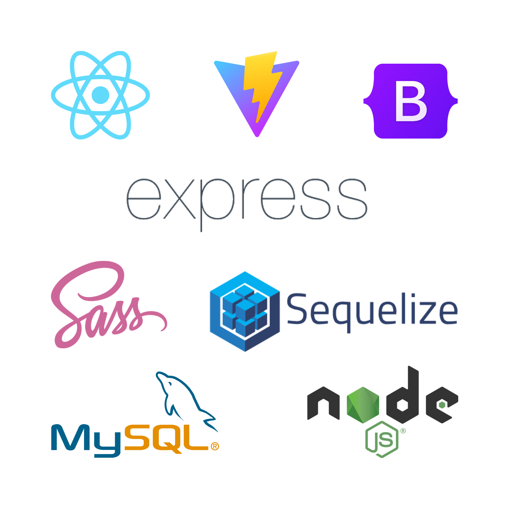
  </div>
</div>
        
---

## 5. Fonctionnalités

### 5.1. Navigation (pages)

<ul class="custom-list">
  <li>Page d'accueil</li>
  <li>Liste des artisans (par catégorie)</li>
  <li>Fiche artisan</li>
  <li>Page 404</li>
  <li>Pages Légales (en cours de construction)</li>
</ul>

### 5.2. Header

<ul class="custom-list">
  <li>Logo</li>
  <li>Menu catégories</li>
  <li>Barre de recherche</li>
</ul>

<div class="page-break"></div>

### 5.3. Footer

<ul class="custom-list">
  <li>Liens pages légales</li>
  <li>Informations de contact</li>
</ul>

### 5.4. Page d'accueil

<ul class="custom-list">
  <li>Présentation du fonctionnement du site en 4 étapes</li>
  <li>Affichage des 3 artisans du mois</li>
</ul>

### 5.5. Page liste des artisans

<ul class="custom-list">
  <li>Filtrage par catégorie</li>
  <li>Affichage sous forme de cards</li>
  <li>Accès à la fiche détaillée</li>
</ul>

### 5.6. Page fiche artisan

<div class="underline">Informations affichées :</div>

<ul class="custom-list">
  <li>Nom</li>
  <li>Image</li>
  <li>Note</li>
  <li>Spécialité</li>
  <li>Localisation</li>
  <li>Site web éventuel</li>
  <li>Description</li>
  <li>Galerie d'images</li>
  <li>Formulaire de contact</li>
</ul>

### 5.7. Fonctionnalités avancées

<ul class="custom-list">
  <li>Chargement dynamique des artisans depuis l'API</li>
  <li>Gestion des erreurs API</li>
  <li>Filtrage par catégorie</li>
  <li>Recherche par nom / ville / spécialité</li>
  <li>Galerie d'images responsive avec ouverture plein écran</li>
  <li>Formulaire de contact sécurisé</li>
  <li>Breadcrumb de navigation</li>
</ul>

---

## 6. Architecture de l'application

<div class="underline">Routes frontend :</div>

```
/                       → page accueil
/artisans               → liste des artisans
/artisans/:id           → fiche artisan
```


Le frontend React communique avec une **API REST** développée avec **Express**.  
Les données sont récupérées depuis une base **MySQL** via l'**ORM Sequelize**.

<div class="underline">L'application est déployée sur plusieurs services afin de séparer :</div>

<ul class="custom-list">
  <li>l'interface utilisateur</li>
  <li>la logique métier</li>
  <li>et le stockage de données</li>
</ul>

<div class="page-break"></div>

.png>)

<div class="page-break"></div>


---

## 7. Livrables attendus

<ul class="custom-list">
  <li>Wireframes (Desktop, Tablet, Mobile)</li>
  <li>API Node.js fonctionnelle</li>
  <li>Base de données MySQL</li>
  <li>Frontend React</li>
  <li>Interface responsive</li>
  <li>Documentation du projet</li>
</ul>

---

<div class="page-break"></div>

## 8. Maquettes et wireframes

<div class="section-label">Lien vers les maquettes Figma</div>

[Voir les maquettes Figma : https://www.figma.com/design/C0moU99nW9cfFlHHRzYXxc/Kernec_Cedric_Devoir_Bilan_Trouve_Ton_Artisan?node-id=38-3103&t=fcY6xDrTEQbigvnm-1](https://www.figma.com/design/C0moU99nW9cfFlHHRzYXxc/Kernec_Cedric_Devoir_Bilan_Trouve_Ton_Artisan?node-id=38-3103&t=fcY6xDrTEQbigvnm-1)

### 8.1. Wireframes

<div class="section-label">Wireframe Mobile</div>


<div class="page-break"></div>

<div class="section-label">Wireframe Tablet</div>


<div class="section-label">Wireframe Desktop</div>

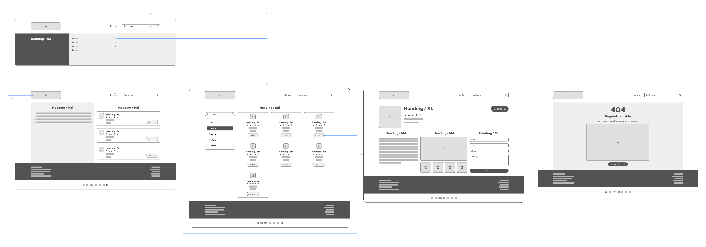

<div class="page-break"></div>

### 8.2. Maquettes

<div class="section-label">Maquette Mobile</div>

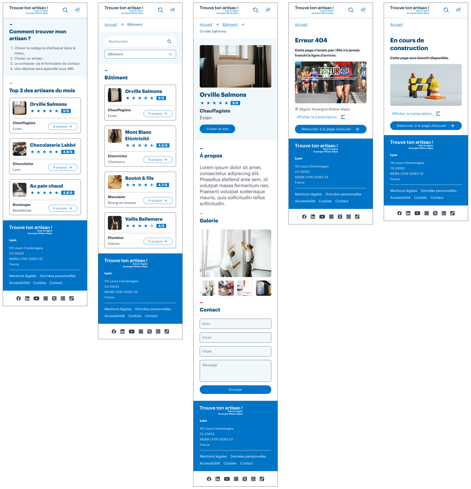

<div class="page-break"></div>

<div class="section-label">Maquette Tablet</div>


<div class="page-break"></div>

<div class="section-label">Maquette Desktop</div>


---

<div class="page-break"></div>

## 9. Base de données

Présentation de la base de données permettant de gérer un annuaire d'artisans.

La base de données a été conçue sur une **logique de modélisation en deux étapes** :

<ul class="custom-list">
  <li>un Modèle Conceptuel de Données (MCD)</li>
  <li>un Modèle Logique de Données (MLD)</li>
</ul>

### 9.1. Modèle Conceptuel de Données (MCD)

Le **MCD** permet de représenter les entités métier et leurs relations avant la phase de développement.

<div class="underline">Il met en évidence :</div>

<div class="layout-grid layout-grid--3">

  <div class="card card--center">
    Les catégories d'artisans
  </div>

  <div class="card card--center">
    Les spécialités associées
  </div>

  <div class="card card--center">
    Les artisans
  </div>

</div>

**Relations :**

<div class="layout-grid layout-grid--stack">

  <div class="card card--code">
    Une catégorie peut être attachée à plusieurs spécialités (1,N)
  </div>

  <div class="card card--code">
    Une spécialité est attachée à une seule catégorie (1,1)
  </div>

  <div class="card card--code">
    Une spécialité peut caractériser plusieurs artisans (1,N)
  </div>

  <div class="card card--code">
    Un artisan est caractérisé par une seule spécialité (1,1)
  </div>

</div>


<div class="page-break"></div>

### 9.2. Modèle Logique de Données (MLD)

Le **MLD** traduit le MCD en structure relationnelle exploitable en base de données.

<div class="underline">Il définit :</div>

<div class="layout-grid layout-grid--4">

  <div class="card card--center">
    <div class="card__title">Tables</div>
    <div class="card__text">
      categories<br>
      specialties<br>
      artisans
    </div>
  </div>

  <div class="card card--center">
    <div class="card__title">Clés primaires</div>
    <div class="card__text">
      PK
    </div>
  </div>

  <div class="card card--center">
    <div class="card__title">Clés étrangères</div>
    <div class="card__text">
      FK
    </div>
  </div>

  <div class="card card--center">
    <div class="card__title">Contraintes</div>
    <div class="card__text">
      Relations<br>
      Intégrité
    </div>
  </div>

</div>

**Relations :**

<div class="layout-grid layout-grid--stack">

  <div class="card card--code">
    specialties.id_category → categories.id
  </div>

  <div class="card card--code">
    artisans.id_specialty → specialties.id
  </div>

</div>

Ce modèle est directement utilisé pour la création de la base de données en SQL.


### 9.3. Script MySQL

Des requêtes SQL ont été mises en place afin de répondre aux fonctionnalités principales du projet :

<div class="layout-grid layout-grid--3">

  <div class="card card--center">
    <div class="card__text">
      Recherche d'artisans
    </div>
  </div>

  <div class="card card--center">
    <div class="card__text">
      Filtrage par catégorie
    </div>
  </div>

  <div class="card card--center">
    <div class="card__text">
      Top des artisans du mois
    </div>
  </div>

</div>

<div class="page-break"></div>

<div class="underline">Exemples :</div>

<div class="section-label" style="margin: 8px 0">Récupérer les 3 artisans du mois</div>

```
SELECT
	a.name AS artisan,
    a.rating,
    s.name AS specialty,
    a.city
FROM artisans a
JOIN specialties s ON a.id_specialty = s.id
WHERE a.is_top = TRUE
ORDER BY a.rating DESC
LIMIT 3;
```

<div class="section-label" style="margin: 8px 0">Récupérer les artisans d'une catégorie</div>

```
SELECT
	a.name AS artisan,
    a.rating,
    s.name AS specialty,
    a.city,
    c.name AS category
FROM artisans a
JOIN specialties s ON a.id_specialty = s.id
JOIN categories c ON s.id_category = c.id
WHERE c.id = 1
ORDER BY a.rating DESC;
```

<div class="section-label" style="margin: 8px 0">Récupérer les artisans suite à une recherche par saisie</div>

```
SELECT
	a.name AS artisan,
    a.rating,
    s.name AS specialty,
    a.city,
    c.name AS category
FROM artisans a
JOIN specialties s ON a.id_specialty = s.id
JOIN categories c ON s.id_category = c.id
WHERE
	a.name LIKE '%au%'
	OR s.name LIKE '%au%'
	OR a.city LIKE '%au%'
ORDER BY a.rating DESC;
```

Ces requêtes ont été testées et validées.

---

## 10. Déploiement

Le projet est déployé sur **3 services distincts** :

<div class="layout-grid layout-grid--3">

  <div class="card card--center">
    <div class="card__title">Netlify</div>
    <div class="card__text">
      Application frontend
    </div>
    
  </div>

  <div class="card card--center">
    <div class="card__title">Render</div>
    <div class="card__text">
      API Express
    </div>
    
  </div>

  <div class="card card--center">
    <div class="card__title">Railway</div>
    <div class="card__text">
      Base de données MySQL
    </div>
    
  </div>

</div>

### 10.1. Architecture de déploiement


### 10.2. Variables d'environnement

Des variables d'environnement ont été utilisées **afin de sécuriser la configuration du projet** :

<ul class="custom-list">
  <li>URL de l'API</li>
  <li>URL du frontend autorisé (CORS)</li>
  <li>Informations de connexion à la base de données</li>
</ul>

**Ces informations sensibles ne sont jamais stockées dans le dépôt GitHub.**

<div class="underline">Cette architecture permet :</div>

<div class="layout-grid layout-grid--3">

  <div class="card card--center">
    <div class="card__text">
      Une meilleure séparation des responsabilités
    </div>
  </div>

  <div class="card card--center">
    <div class="card__text">
      Une maintenance simplifiée
    </div>
  </div>

  <div class="card card--center">
    <div class="card__text">
      Un hébergement indépendant
    </div>
  </div>

</div>

---

<div class="page-break"></div>

## 11. Veille sécurité

### 11.1 Méthodologie de veille

Dans le cadre du développement du projet, une veille de sécurité a été menée afin d'identifier les vulnérabilités courantes susceptibles d'affecter une application web exposant une API backend.

<div class="card card--with-header">
  <div class="card__title--with-header">Objectif</div>
  <div class="card__text--with-header">
    Anticiper les risques de sécurité et de vulnérabilité applicable à l'architecture du projet (frontend React + API Express + base de données MySQL).
  </div>
</div>

**Sources** :
Les principales sources consultées ont été :

<div class="panel panel--grid-2-col">

  <div class="panel__label">OWASP Top 10</div>
  <div class="panel__value"><a href="https://owasp.org/www-project-top-ten/" target="_blank" rel="noopener noreferrer">https://owasp.org/www-project-top-ten/</a></div>

  <div class="panel__label">Documentation officielle Express</div>
  <div class="panel__value"><a href="https://expressjs.com/" target="_blank" rel="noopener noreferrer">https://expressjs.com/</a></div>

  <div class="panel__label">Documentation officielle Helmet</div>
  <div class="panel__value"><a href="https://github.com/helmetjs/helmet" target="_blank" rel="noopener noreferrer">https://github.com/helmetjs/helmet</a></div>

  <div class="panel__label">Documentation MDN Web Docs</div>
  <div class="panel__value"><a href="https://developer.mozilla.org/" target="_blank" rel="noopener noreferrer">https://developer.mozilla.org/</a></div>

  <div class="panel__label">Documentation express-rate-limit</div>
  <div class="panel__value"><a href="https://github.com/express-rate-limit/express-rate-limit" target="_blank" rel="noopener noreferrer">https://github.com/express-rate-limit/express-rate-limit</a></div>

</div>

Cette veille a permis d'identifier plusieurs risques concrets liés aux entrées utilisateur, aux erreurs serveur, aux abus d'API ainsi qu'aux politiques de sécurité navigateur.

### 11.2. Vulnérabilités étudiées

#### 11.2.1. Entrées utilisateur non fiables

<div class="title--danger">Risques :</div>

<div class="layout-grid layout-grid--3">

  <div class="card card--center card--danger">
    <div class="card__text">
      Données invalides
    </div>
  </div>

  <div class="card card--center card--danger">
    <div class="card__text">
      Injections
    </div>
  </div>

  <div class="card card--center card--danger">
    <div class="card__text">
      Corruption
    </div>
  </div>

</div>

#### 11.2.2. Exposition excessive des erreurs serveur

<div class="title--danger">Risques :</div>

<div class="layout-grid layout-grid--2">

  <div class="card card--center card--danger">
    <div class="card__text">
      Fuite stack trace
    </div>
  </div>

  <div class="card card--center card--danger">
    <div class="card__text">
      Structure backend exposée
    </div>
  </div>

</div>

<div class="page-break"></div>

#### 11.2.3. Abus d'API / spam / surcharge

<div class="title--danger">Risques :</div>

<div class="layout-grid layout-grid--2">

  <div class="card card--center card--danger">
    <div class="card__text">
      Spam formulaire
    </div>
  </div>

  <div class="card card--center card--danger">
    <div class="card__text">
      Surcharges des ressources serveur
    </div>
  </div>

</div>

#### 11.2.4. Requêtes cross-origin non maîtrisées

<div class="title--danger">Risques :</div>

<div class="layout-grid layout-grid--stack">

  <div class="card card--center card--danger">
    <div class="card__text">
      Appels navigateur non souhaités
    </div>
  </div>

</div>

#### 11.2.5. Headers HTTP insuffisants

<div class="title--danger">Risques :</div>

<div class="layout-grid layout-grid--stack">

  <div class="card card--danger">
    <div class="card__title">XSS (Cross-Site Scripting)</div>
    <div class="card__text">
      Vulnérabilité permettant d'injecter du code malveillant dans une application web afin qu'il soit exécuté par le navigateur.
    </div>
  </div>

  <div class="card card--danger">
    <div class="card__title">Clickjacking</div>
    <div class="card__text">
      Technique consistant à piéger un utilisateur intégrant l'application dans un cadre invisible (`iframe`) ou trompeur afin de détourner ses clics.
    </div>
  </div>

</div>

### 11.3. Arbitrages réalisés dans le projet

Cette veille a influencé les choix d'architecture présentés dans la section `11. Sécurité mise en place`, notamment :

<ul class="custom-list">
  <li>validation systématique côté backend</li>
  <li>sanitization des entrées utilisateurs</li>
  <li>limitation de débit des requêtes</li>
  <li>sécurisation des headers HTTP</li>
  <li>gestion centralisée des erreurs</li>
  <li>masquage des informations sensibles en production</li>
</ul>

---

<div class="page-break"></div>

## 12. Sécurité mise en place

### 12.1. Sécurisation des headers HTTP (Helmet)

Afin de **renforcer la sécurité globale de l'API backend**, le middleware `Helmet` a été mis en place.

**Helmet** ajoute automatiquement plusieurs en-têtes HTTP de sécurité permettant de limiter certaines attaques côté navigateur.

<div class="underline">Cela permet de :</div>

<div class="layout-grid layout-grid--2">
  <div class="card card--center">
    <div class="card__text">
      Réduire le risque XSS*
    </div>
  </div>
  <div class="card card--center">
    <div class="card__text">
      Limiter le risque de clickjacking**
    </div>
  </div>
  <div class="card card--center">
    <div class="card__text">
      Une meilleure sécurité navigateur
    </div>
  </div>
  <div class="card card--center">
    <div class="card__text">
      Masquer les informations techniques
    </div>
  </div>
</div>

<div class="panel panel--grid-2-col">

  <div class="panel__label">
    *XSS (Cross-Site Scripting)
  </div>
  <div class="panel__value">
    Vulnérabilité permettant à un utilisateur malveillant d'injecter du code dans une application web afin qu'il soit exécuté par le navigateur.
  </div>

  <div class="panel__label">
    *Clickjacking
  </div>
  <div class="panel__value">
    Technique consistant à piéger un utilisateur intégrant l'application dans un carde invisible (`iframe`) ou trompeur afin de détourner ses clics.
  </div>

</div>

<div class="card card--with-header" style="margin-top: 16px">
  <div class="card__title--with-header">Configuration spécifique</div>
  <div class="card__text--with-header">
    <div class="card card--code">
      crossOriginResourcePolicy: { policy: "cross-origin" }
    </div>
    <div class="note">
      Cette configuration permet l'accès contrôlé aux ressources statiques (notamment les images des artisans) depuis le frontend React hébergé sur une origine différente du backend API.<br><br>
      Sans cet ajustement, certaines ressources auraient été bloquées par le navigateur.
    </div>
  </div>
</div>

<div class="page-break"></div>

### 12.2. Contrôle des requêtes cross-origin (CORS)

Le backend expose une API consommée par une application frontend React.
Par défaut, les navigateurs bloquent les requêtes entre origines différentes pour des raisons de sécurité.

Le middleware `CORS` a donc été configuré **afin d'autoriser uniquement le frontend officiel**.

<div class="underline">Cela permet de :</div>

<div class="layout-grid layout-grid--2">
  <div class="card card--center">
    <div class="card__text">
      Limiter les requêtes cross-origin autorisées depuis un navigateur
    </div>
  </div>
  <div class="card card--center">
    <div class="card__text">
      Centraliser la configuration selon l'environnement (development/production)
    </div>
  </div>
</div>

<div class="card card--with-header" style="margin-top: 16px">
  <div class="card__title--with-header">Configuration CORS</div>
  <div class="card__text--with-header">
    <div class="card card--code">
      origin: process.env.FRONTEND_URL
    </div>
    <div class="note">
      Cette configuration autorise uniquement le frontend officiel à consommer l'API depuis le navigateur.<br><br>
      L'utilisation d'une variable d'environnement permet d'adapter l'URL selon l'environnement sans l'écrire directement dans le code source.
    </div>
  </div>
</div>

### 12.3. Limitation de la taille des requêtes JSON envoyées

Le backend accepte des données JSON provenant du frontend, notamment lors de l'envoi du formulaire de contact.

**Afin d'éviter les abus ou l'envoi de charges excessives, une limite de taille a été définie.**

<div class="underline">Cela permet de :</div>

<div class="layout-grid layout-grid--3">
  <div class="card card--center">
    <div class="card__text">
      Limiter la surcharge mémoire
    </div>
  </div>
  <div class="card card--center">
    <div class="card__text">
      Bloquer les contenus anormalement volumineux
    </div>
  </div>
  <div class="card card--center">
    <div class="card__text">
      Réduire le risque de déni de service (DoS)*
    </div>
  </div>
</div>

<div class="panel panel--grid-2-col">

  <div class="panel__label">
    *Denial of Service (DoS)
  </div>
  <div class="panel__value">
     Attaque visant à saturer un serveur par un très grand nombre de requêtes afin de perturber ou empêcher son fonctionnement normal.
  </div>

</div>

<div class="card card--with-header" style="margin-top: 16px">
  <div class="card__title--with-header">Limitation des requêtes JSON</div>
  <div class="card__text--with-header">
    <div class="card card--code">
      express.json({ limit: "10kb" })
    </div>
    <div class="note">
      Cette limite empêche l'envoi de charges JSON trop volumineuses vers l'API.<br><br>
      Dans ce projet, 10kb est suffisant pour les données attendues du formulaire de contact.
    </div>
  </div>
</div>

<div class="page-break"></div>

### 12.4. Validation des données côté serveur

Même si le frontend applique déjà des contrôles sur le formulaire de contact, **aucune validation côté client ne doit être considérée comme suffisante en matière de sécurité**. Un utilisateur malveillant peut contourner totalement l'interface frontend et envoyer directement des requêtes vers l'API.

Pour cette raison, **une validation complète est systématiquement effectuée côté backend**.

<div class="underline">Les champs contrôlés sont :</div>

<ul class="custom-list">
  <li>Nom</li>
  <li>Adresse email</li>
  <li>Objet du message</li>
  <li>Contenu du message</li>
</ul>

<div class="underline">Le backend vérifie notamment :</div>

<div class="layout-grid layout-grid--3">
  <div class="card card--center">
    <div class="card__text">
      La présence des champs obligatoires
    </div>
  </div>
  <div class="card card--center">
    <div class="card__text">
      Le format de l'adresse email
    </div>
  </div>
  <div class="card card--center">
    <div class="card__text">
      La conformité des valeurs attendues
    </div>
  </div>
</div>

<div class="underline">En cas d'erreur une réponse structurée est retournée :</div>

```
{
  "success": false,
  "error": {
    "message": "Données invalides.",
    "code": "VALIDATION_ERROR",
    "fields": {
      "email": "Adresse email invalide"
    }
  }
}
```

Cela garantit que seules des données valides peuvent être traitées par l'application.

### 12.5. Nettoyage des données utilisateur (Sanitization)

Avant validation et traitement, les données envoyées par l'utilisateur sont nettoyées via une étape de `sanitization`.

<div class="underline">Cette étape permet de :</div>

<ul class="custom-list">
  <li>supprimer des espaces inutiles</li>
  <li>neutraliser des caractères spéciaux potentiellement interprétables par le navigateur</li>
  <li>normaliser des chaînes utilisateur avant validation</li>
</ul>

<div class="underline">Cette pratique permet de :</div>

<div class="layout-grid layout-grid--3">
  <div class="card card--center">
    <div class="card__text">
      Éviter les incohérences de données
    </div>
  </div>
  <div class="card card--center">
    <div class="card__text">
      Fiabiliser la validation
    </div>
  </div>
  <div class="card card--center">
    <div class="card__text">
      Réduire certains comportements inattendus liés aux entrées utilisateurs
    </div>
  </div>
</div>

### 12.6. Protection contre l'abus de requêtes (Rate Limiting)

Le backend met en place une limitation du nombre de requêtes afin de protéger l'API contre les usages abusifs.

Deux niveaux de protection ont été implémentés à l'aide du middleware `express-rate-limit`.

#### 12.6.1. Protection globale de l'API

Une limitation générale est appliquée à l'ensemble des routes de l'API.

<div class="underline">Principe :</div>

<ul class="custom-list">
  <li>maximum 300 requêtes</li>
  <li>sur une période de 15 minutes</li>
  <li>par adresse IP</li>
</ul>

<div class="underline">Cette protection permet de :</div>

<div class="layout-grid layout-grid--3">
  <div class="card card--center">
    <div class="card__text">
      Limiter les usages abusifs involontaires ou automatisés
    </div>
  </div>
  <div class="card card--center">
    <div class="card__text">
      Réduire les risques de surcharge serveur
    </div>
  </div>
  <div class="card card--center">
    <div class="card__text">
      Éviter une consommation excessive des ressources backend
    </div>
  </div>
</div>

<div class="underline">Un retour explicite est envoyé en cas de dépassement :</div>

```
{
  "success": false,
  "error": {
    "message": "Trop de requêtes exécutées. Veuillez réessayer ultérieurement.",
    "code": "RATE_LIMIT_EXCEEDED"
  }
}
```

#### 12.6.2. Protection du formulaire de contact

Le formulaire de contact constitue un point d'entrée plus sensible car il peut être ciblé pour du spam automatisé.

<div class="underline">Une limitation plus stricte a donc été appliquée :</div>

<ul class="custom-list">
  <li>maximum 10 tentatives</li>
  <li>sur une période de 15 minutes</li>
  <li>par adresse IP</li>
</ul>

<div class="underline">Cette protection permet de limiter :</div>

<div class="layout-grid layout-grid--3">
  <div class="card card--center">
    <div class="card__text">
      Le spam automatisé
    </div>
  </div>
  <div class="card card--center">
    <div class="card__text">
      Les envois massifs abusifs
    </div>
  </div>
  <div class="card card--center">
    <div class="card__text">
      Les tentatives de surcharge de l'API
    </div>
  </div>
</div>

<div class="page-break"></div>

<div class="underline">Un retour explicite est envoyé en cas de dépassement :</div>

```
{
  "success": false,
  "error": {
    "message": "Trop de tentatives d'envoi du formulaire. Veuillez réessayer ultérieurement.",
    "code": "CONTACT_RATE_LIMIT_EXCEEDED"
  }
}
```

### 12.7. Gestion centralisée des erreurs API

Une architecture centralisée de gestion des erreurs a été mise en place **afin d'assurer des réponses cohérentes, sécurisées et facilement exploitables par le frontend**.

<div>Sans ce mécanisme, <span class="underline">chaque contrôleur devrait gérer individuellement ses propres erreurs</span>, ce qui entraînerait :</div>

<div class="layout-grid layout-grid--2">
  <div class="card card--center card--danger">
    <div class="card__text">
      Une duplication importante du code
    </div>
  </div>
  <div class="card card--center card--danger">
    <div class="card__text">
      Des réponses API incohérentes selon les endpoints
    </div>
  </div>
  <div class="card card--center card--danger">
    <div class="card__text">
      Une maintenance plus complexe
    </div>
  </div>
  <div class="card card--center card--danger">
    <div class="card__text">
      Un risque d'exposition involontaire d'informations techniques sensibles
    </div>
  </div>
</div>

#### 12.7.1. Classe métier `ApiError`

Une classe personnalisée `ApiError` a été créée **afin de représenter les erreurs métier contrôlées.**

<div class="underline">Elle permet de transporter de manière structurée :</div>

<ul class="custom-list">
  <li>le code HTTP (<code>statusCode</code>)</li>
  <li>un identifiant fonctionnel (<code>code</code>)</li>
  <li>un message utilisateur (<code>message</code>)</li>
  <li>des détails complémentaires éventuels de champs (<code>fields</code>)</li>
</ul>

<div class="underline">Exemple :</div>

```
throw new ApiError(
  404,
  "ARTISAN_NOT_FOUND",
  "Artisan non trouvé"
);
```

<div class="note">Cette approche est plus robuste qu'une erreur JavaScript standard (<code>Error</code>) car elle permet de transmettre des informations précises au middleware global. L'<code>ApiError</code> hérite du comportement standard de la classe JavaScript <code>Error</code>.</div>

<div class="page-break"></div>

#### 12.7.2. Middleware global de gestion des erreurs

**Un middleware Express** dédié (`apiErrorHandler`) centralise le traitement de toutes les erreurs de l'application.

<div class="underline">Son rôle est :</div>

<ul class="custom-list">
  <li>d'intercepter automatiquement les erreurs propagées via <code>next(error)</code></li>
  <li>identifier les erreurs métier contrôlées</li>
  <li>normaliser le format des réponses JSON</li>
  <li>éviter la duplication de logique dans les contrôleurs</li>
</ul>

<div class="underline">Format de réponse standard :</div>

```
{
  "success": false,
  "error": {
    "message": "Données invalides.",
    "code": "VALIDATION_ERROR",
    "fields": {
      "email": "Format d'email invalide"
    }
  }
}
```

#### 12.7.3. Protection des informations sensibles

En **environnement de développement**, la pile d'erreur (`stack`) est conservée **afin de faciliter le débogage**.
En **environnement de production**, ces informations sont **volontairement masquées**.

<div class="underline">Cela évite d'exposer :</div>

<ul class="custom-list">
  <li>la structure interne du backend</li>
  <li>les chemins de fichiers serveur</li>
  <li>les dépendances utilisées</li>
  <li>des détails techniques exploitables par un attaquant</li>
</ul>

<div class="page-break"></div>

#### 12.7.4. Cohérence frontend / backend

Le frontend exploite un format d'erreur unique grâce à une normalisation côté client via l'utilitaire `buildApiError()`.

Les erreurs API sont ainsi converties dans une structure homogène :

- `error.message`
- `error.code`
- `error.fields`

<div class="underline">Cela permet :</div>

<ul class="custom-list">
  <li>l'affichage des erreurs de validation champ par champ ou groupées</li>
  <li>la gestion des erreurs métier</li>
  <li>la prise en charge des limitations de requêtes (<code>rate limiting</code>)</li>
</ul>

<div class="underline">Exemple :</div>

<div class="panel panel--grid-2-col" style="margin-top: 16px">

  <div class="panel__label">Formulaire invalide</div>
  <div class="panel__value">Affichage des erreurs par champ ou groupées</div>

  <div class="panel__label">Artisan inexistant</div>
  <div class="panel__value">Message métier explicite</div>

  <div class="panel__label">Trop de tentatives</div>
  <div class="panel__value">Message de limitation clair</div>

</div>

#### 12.7.5. Séparation des responsabilités

Cette architecture applique une séparation claire des responsabilités :

<div class="layout-grid layout-grid--3">
  <div class="card card--center card--with-header">
    <div class="card__title--with-header">Service</div>
    <div class="card__text--with-header">
      Logique métier
    </div>
  </div>
  <div class="card card--center card--with-header">
    <div class="card__title--with-header">Controller</div>
    <div class="card__text--with-header">
      Gestion des requêtes HTTP
    </div>
  </div>
  <div class="card card--center card--with-header">
    <div class="card__title--with-header">Middleware d'erreur</div>
    <div class="card__text--with-header">
      Transformation des erreurs en réponses API standardisées
    </div>
  </div>
</div>

<div class="underline">Cette organisation améliore :</div>

<div class="layout-grid layout-grid--3">
  <div class="card card--center">
    <div class="card__text">
      La lisibilité du code
    </div>
  </div>
  <div class="card card--center">
    <div class="card__text">
      La maintenabilité
    </div>
  </div>
  <div class="card card--center">
    <div class="card__text">
      La réutilisabilité
    </div>
  </div>
</div>

---

<div class="page-break"></div>

## 13. Qualité du projet

### 13.1. Validation W3C

Le projet a été validé à l'aide des outils du W3C **afin de vérifier la conformité du code HTML généré.**

<div class="underline">Les principales pages du projet sont validées :</div>

- Page d'accueil
- Liste des artisans
- Fiche artisan

**Aucune erreur bloquante** n'est détectée lors des contrôles.


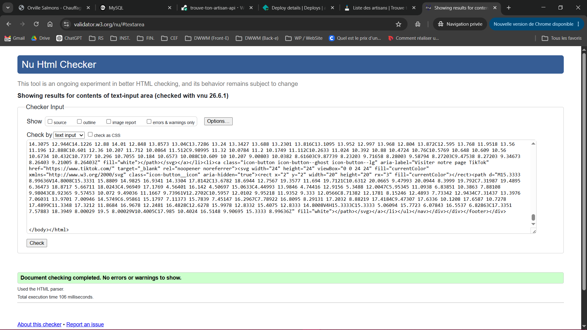
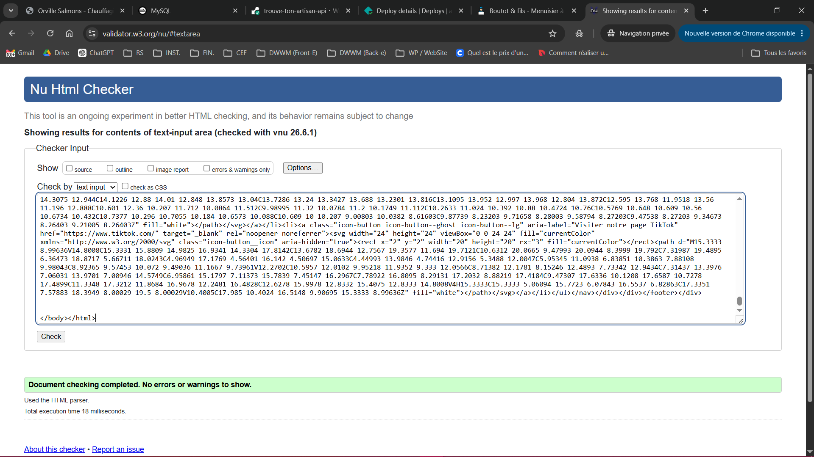

<div class="page-break"></div>

### 13.2. Audit Lighthouse

<div class="underline">Des audits Lighthouse ont été réalisés afin de mesurer :</div>

<div class="layout-grid layout-grid--4">
  <div class="card card--center">
    <div class="card__text">
      Les performances
    </div>
  </div>
  <div class="card card--center">
    <div class="card__text">
      L'accessibilité
    </div>
  </div>
  <div class="card card--center">
    <div class="card__text">
      Les bonnes pratiques
    </div>
  </div>
  <div class="card card--center">
    <div class="card__text">
      Le référencement
    </div>
  </div>
</div>

<div class="underline">Les principales pages de l'application ont été auditées sur mobile et desktop :</div>

- Page d'accueil
- Liste des artisans
- Fiche artisan

<div class="underline">Les résultats obtenus montrent :</div>

<ul class="custom-list">
  <li>un bon niveau d'accessibilité</li>
  <li>des performances satisfaisantes</li>
  <li>une conformité SEO correct</li>
  <li>l'abscence de problème majeur bloquant</li>
</ul>

<div class="section-label">Audit Lighthouse - Mobile</div>

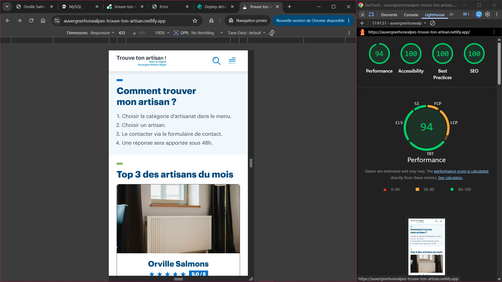
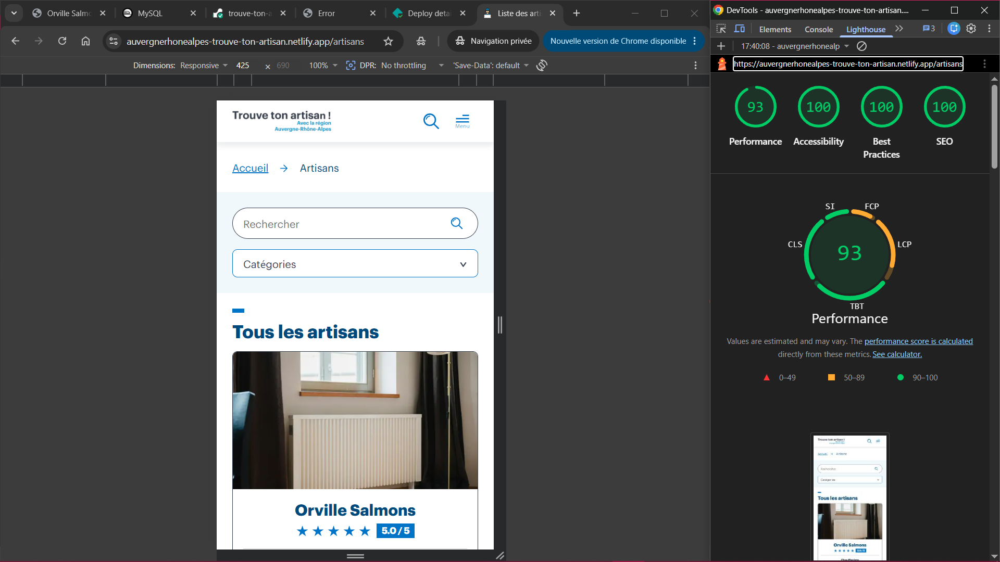
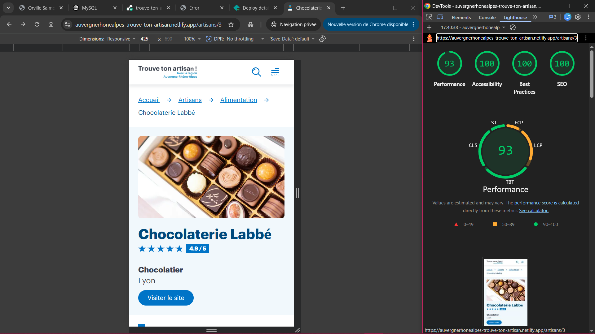

<div class="page-break"></div>

<div class="section-label">Audit Lighthouse - Desktop</div>

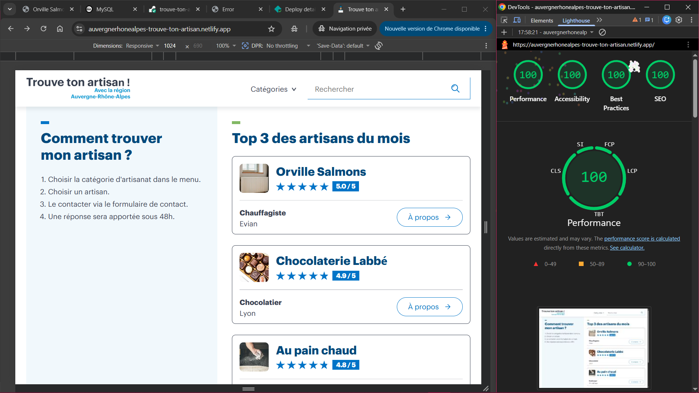
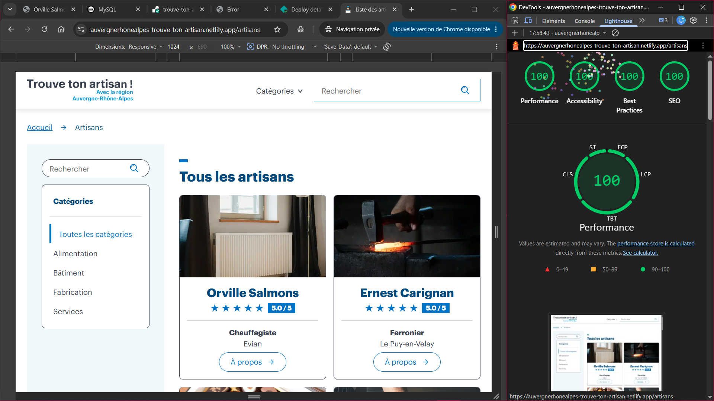
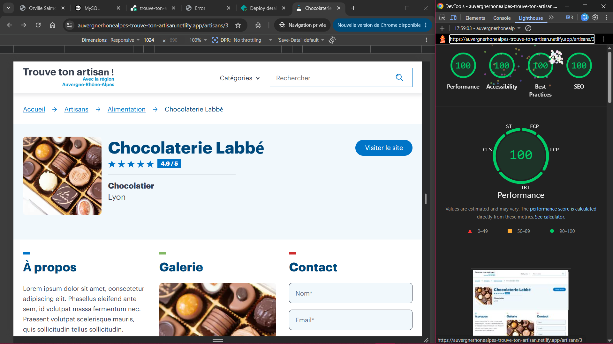

## 14. Liens du projet

<div class="panel panel--grid-2-col" style="margin-top: 34px">

  <div class="panel__label">Dépôt GitHub</div>
  <div class="panel__value">
    <a href="https://github.com/pixseed/devoir-bilan-trouve-ton-artisan" target="_blank" rel="noopener noreferrer">
      https://github.com/pixseed/devoir-bilan-trouve-ton-artisan
    </a>
  </div>

  <div class="panel__label">Application en ligne</div>
  <div class="panel__value">
    <a href="https://auvergnerhonealpes-trouve-ton-artisan.netlify.app/" target="_blank" rel="noopener noreferrer">
      https://auvergnerhonealpes-trouve-ton-artisan.netlify.app/
    </a>
  </div>

  <div class="panel__label">API backend</div>
  <div class="panel__value">
    <a href="https://trouve-ton-artisan-api-xt2w.onrender.com/" target="_blank" rel="noopener noreferrer">
      https://trouve-ton-artisan-api-xt2w.onrender.com/
    </a>
  </div>
</div>
